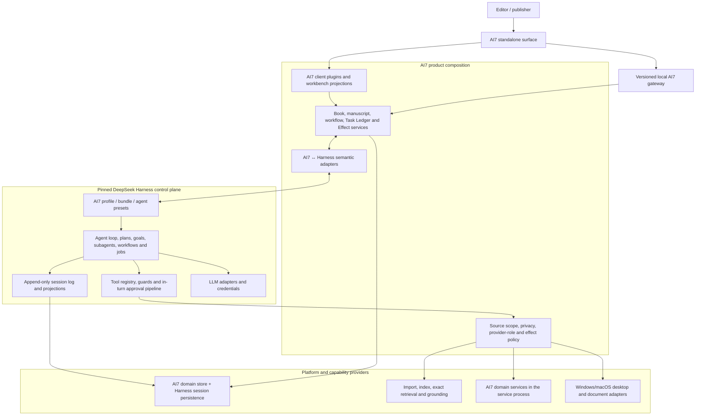

# Proposed Target Architecture

Status: **substantially accepted; the remaining proposals are narrow and listed below**

## What is accepted, and what is not

The blanket “not accepted” label this document previously carried had become misleading: `AGENTS.md`, the charter, and several ADRs already depend on parts of it. The split is exact:

**Accepted, and binding:**

- The three-layer Foundation Model / Harness Agent Behavior / AI7 Editorial Intelligence separation, and the no-LLM-training invariant — Question 14 and the owner's Harness-purpose statement, ADR 0003.
- Harness as AI7's Agent Behavior Framework rather than merely an agent-loop dependency — the owner's statement at Question 15.
- The record-ownership split: AI7 owns manuscript history, named authorities, Effects, receipts, Policy Documents, and the Task Ledger; the Harness Session Ledger owns model/executor events; the two are joined by Execution Bindings — ADRs 0006, 0007, 0011.
- One Standalone product on Windows and macOS in V1, no Word — ADRs 0013 and 0027.

**Still proposals, and not to be treated as project truth:**

- ~~The product composition boundary below~~ — **accepted in principle**: Question 30 fixed exact-version subset consumption and Question 34 fixed the three-process topology. The exact selected-package closure and effective composition remain Phase 0 audit work, not settled implementation detail.
- ~~The architecture-alternatives table and its “Preferred” marking~~ — **accepted at Question 30**: exactly pinned public packages, taking only the subset AI7 needs. Source fork and process/SDK boundary remain documented fallbacks rather than the plan. See [ADR 0020](../docs/adr/0020-consume-pinned-harness-package-subset.md).
- ~~The claim that AI7 must own the semantic quality evaluation layer~~ — **accepted at Question 36**, which built the metric system and the Behavior Evaluation Gate on exactly this premise (ADR 0019). It was a reported audit finding until then.
- ~~The core process topology~~ — **accepted at Question 34**: Electron main, renderer, and a separate AI7 service process, preferably using stdio and never a TCP listener. A Windows named pipe remains an accepted option; the exact macOS carrier/protocol adaptation is still open (ADRs 0024 and 0027).
- Semantic mappings other than Run Record ↔ Session, which Question 22 settled.

## Recommendation

Build an AI7-owned product layer over an exactly pinned Harness distribution:

- Harness is the single generic agent execution plane and the framework for composing, observing, and improving Agent Behavior.
- AI7 contributes a profile/bundle, domain services, model-facing capabilities, policy adapters, durable projections, and UI/host extensions.
- AI7 business records remain distinct from Harness execution records and are linked by stable correlation IDs.
- No Python ships. AI7 is TypeScript and Node throughout, and legacy Python domain behavior is re-expressed from contract rather than wrapped (ADR 0022).
- The Editorial Capability Profile exposes only domain-shaped capabilities; the Developer Capability Profile carries the generic tool surface and never ships to editors, with no self-service escalation between them (ADR 0017).
- AI7 never trains or fine-tunes the Foundation Model. Its durable intelligence is the provider-independent Editorial Intelligence Layer of governed sources, knowledge, memory, policies, skills, tools, provenance, and evaluation.
- V1 exposes one Windows-and-macOS Standalone product with a new professional manuscript editor. Microsoft Word is a deferred contingency, not a peer surface or release dependency. The exact cross-platform consistency contract and native adapters remain open under ADR 0027.

## Three-layer model

| Layer | Primary responsibility | What AI7 preserves when another Foundation Model is selected |
| --- | --- | --- |
| Foundation Model capability | General language, reasoning, and generation supplied by a replaceable external model | No model weights; only the provider-neutral requirement, binding, and evaluation evidence |
| Harness Agent Behavior Layer | How an agent assembles context, plans, selects tools, coordinates subagents, applies policy, handles approvals/recovery, records sessions, and completes work | Versioned profiles, bundles, presets, plugins, prompts/context, policies, workflows, replay/snapshots, and AI7-owned behavior-evaluation evidence |
| AI7 Editorial Intelligence Layer | What professional editorial knowledge, exact sources, rubrics, memory, authority, provenance, and quality standards govern the work | All AI7-owned professional knowledge and domain records |

These layers cooperate but are not substitutes. A stronger model does not replace editorial knowledge; Editorial Learning does not rewrite model weights; Agent Behavior Improvement changes the versioned Harness composition and its evaluation evidence. “Learning from DeepSeek Harness” therefore means understanding and adopting its framework and extension patterns, not allowing an agent to rewrite its runtime silently.

The diagram shows ownership. The process topology was settled at Question 34 and retained by ADR 0027: a thin Electron main, a renderer holding the UI and editor, and a separate Node service process holding AI7 domain services together with the composed Harness runtime. Local IPC prefers stdio and never opens a TCP listener. Windows named-pipe support remains an accepted option; the exact macOS carrier and protocol adaptation are open under ADR 0027. AI7 does not embed the Harness web client, which Question 31 rejected along with the rest of the Harness product surface.

## Ownership boundaries

| Concern | Proposed canonical owner | Notes |
| --- | --- | --- |
| Model turns, tool calls, agent lifecycle, subagents | Harness | Do not fork `agent-loop` unless an extension-seam gap is proven. |
| Agent-visible history | Harness Session log | Every model-visible AI7 input needs a durable event/projection. |
| Books, source assets, manuscript blocks/revisions, publication state | AI7 domain services | These are product truth, not generic Harness workspace state. |
| Cross-Book editorial patterns and feedback | AI7 House Editorial Memory | Derived learning is user-owned, versioned, inspectable, and provider-independent; it does not grant direct access to every Book's text. |
| Series canon, continuity, and shared member knowledge | AI7 Series service | Explicit membership enables shared Series Knowledge and exact read-only retrieval across non-excluded member sources; mutations remain Book-owned. |
| Task-business lifecycle and provenance | AI7 Task Ledger plus owning domain records | Run, workflow, decision, command, and Effect facts survive Harness attempts without recreating a technical event timeline. |
| Tool execution policy | Harness pipeline + AI7 policy plugins | AI7 adds source/privacy/effect rules through canonical seams. |
| One-shot in-turn tool consent | Harness approval seam | Insufficient for durable/out-of-turn editorial approval by itself. |
| Durable Approval, Effect, receipt, replay safety | AI7 | Correlate to Harness turn/tool IDs without collapsing concepts. |
| Product authority rules and revisions | AI7 Policy Documents | Human-reviewable and machine-validatable; post-run agents may author evidence-linked proposed versions without rewriting history. |
| Model/provider transport | Harness LLM adapters | AI7 adds role, privacy, budget, fallback, and credential-reference policy. |
| Agent behavior composition and improvement | Harness profiles, bundles, presets, plugins, session events, replay, and snapshots | AI7 versions and evaluates the effective composition; this is neither model training nor editorial-memory promotion. |
| Agent-behavior and editorial-quality evaluation | AI7 evaluation service over Harness replay/snapshot evidence | The pinned Harness has substantial deterministic regression support but no general quality evaluator or independent goal verifier. |
| Professional adaptation and delivery quality | AI7 Editorial Intelligence Layer | Uses professionally governed knowledge/context and feedback; never updates Foundation Model weights. |
| Standalone workbench and manuscript editor | AI7 client/shell plus manuscript capabilities | Preserve accepted professional outcomes, not the old monolithic renderer/editor; editing quality is release-critical. |
| Future Word alternative | No V1 owner | Old Host-binding/synchronization contracts remain contingency evidence until a later ADR justifies a Word surface. |
| Generic coding tools | Harness distribution, curated by profile | Default exposure is a product/security decision. |

## Semantic mapping—not synonym mapping

| AI7 concept | Nearest Harness concept | Proposed relationship |
| --- | --- | --- |
| Book project | Workspace / cwd | A Book is domain data. A Harness workspace may locate files but must not define Book identity. |
| Task Skill | Skill, preset, tools, workflow | AI7 Task Skill is richer: trust, schemas, source scope, approvals, UI, and evidence. Adapt it into several Harness primitives rather than reducing it to `SKILL.md`. |
| Run Record | Session and agent lineage | Link exact Harness Execution Spans through an Execution Binding. A Run is scoped semantic provenance; a Session is the model/execution event stream. |
| Retired legacy Operation Record | Turn, Goal, Job, Workflow | Do not map or recreate it. Move business facts to their owning Run/workflow/decision/Effect records and derive live status from Harness Session Events. |
| Durable Approval | `ctx.approval` | Use the Harness seam for in-turn asks; keep the durable AI7 record for resumable, exact-target decisions. |
| Effect + commit receipt | Tool call/result | A tool call may initiate an Effect; only AI7's fenced external commit protocol establishes product truth. |
| Q&A conversation / turn | Session / turn | Candidate for close mapping, but revision/source-scope pinning and reopen semantics must be specified first. |
| Provider role plan | LLM adapter/model setting | Add an AI7 resolver that selects a Harness adapter/model under privacy, budget, and fallback constraints. |
| Shared local backend | Harness Host + AI7 domain authority | The separate AI7 service process is the one deployed authority. The renderer reaches it only through typed AI7 IPC; stdio is preferred, TCP is excluded, and the exact macOS carrier/protocol adaptation remains open. |

## Product composition

The binding composition rule is explicit admission, not inheritance from a Harness product bundle:

1. Pin one coherent Harness package version with a committed lockfile and retain the audited source identity separately.
2. Inspect the installed dependency closure and include only individually justified packages and seams. Do not depend on the CLI aggregate, generic coding tools, `dsh-base`, or the Web product bundle merely for convenience.
3. Build an AI7-owned composition that mounts the required Harness primitives behind AI7 domain services, capability facades, providers, and policy guards.
4. Add AI7 editorial presets with isolated per-Run tools, context, source scope, and Capability Grants; do not adapt the upstream coding presets.
5. Add only trusted, shipped AI7 client modules around the independently owned manuscript editor. UI state never becomes manuscript or Task authority.
6. Freeze and inspect the complete effective Cordis tree. Because a row override replaces its whole configuration, every pin bump must revalidate configuration, package exposure, session compatibility, and the AI7 journeys.

The concrete package list in Question 30 is a first-cut classification. Phase 0 must audit the rc.5-to-rc.6 delta and exact selected-package closure before this sequence is implementation-ready.

## Architecture alternatives

| Option | Fit | Main advantage | Main cost | Recommendation |
| --- | --- | --- | --- | --- |
| Fresh AI7 repo + pinned Harness packages + AI7 extensions | High | Clean ownership and smallest upstream boundary | Must validate public package seams and upgrades | **Preferred** |
| Fresh AI7 repo + pinned Harness process/SDK boundary | Medium-high | Strong isolation from dependency churn and Electron ABI | SDK/ACP omit important rich capabilities; extra IPC | Useful transitional seam |
| Maintain a source fork with AI7 packages in the Harness monorepo | Medium | Maximum internal access | Continuous merge burden across a very large preview codebase | Fallback only after seam-gap proof |
| Keep current AI7 app and add Harness as a sidecar | Medium-low | Short-term reuse | Split lifecycle/session/approval authority and prolonged dual runtime | Transitional experiment only |
| Port AI7 directly into Harness core | Low | Apparent integration depth | Breaks plugin architecture and makes upgrades expensive | Reject |

## Non-negotiable review checks

- Exactly one component owns each state transition.
- No source text reaches a model without exact revision and scope provenance.
- An exact manuscript quotation proves what the revision says, not that a Manuscript Assertion is true; factual and semantic review use separately identified evidence and status.
- No model-facing AI7 state exists only in process memory.
- No external mutation is silently retried after an ambiguous outcome.
- No user-authored skill gains trust or authority from editable manifest claims.
- No Harness web server is exposed to a network without a separately accepted authentication, origin, and transport-security design.
- No upstream upgrade is accepted from compilation alone; effective config, session compatibility, security defaults, and AI7 journeys must pass.
