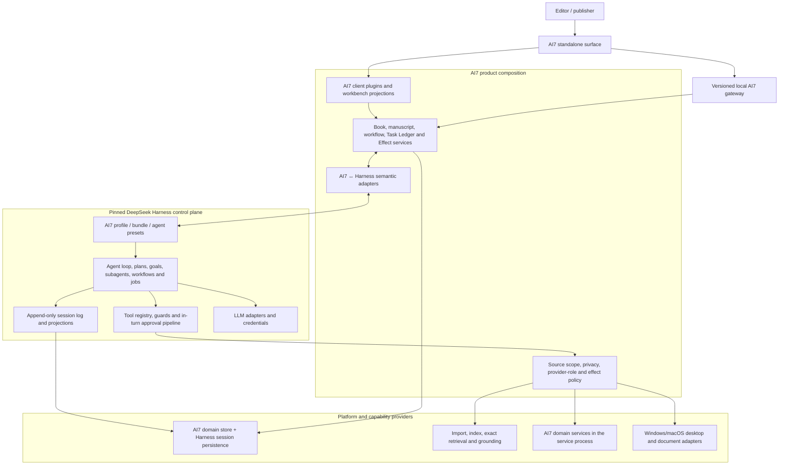

# Accepted Target Architecture Synthesis

Status: **accepted `dev` architecture synthesis; the detailed implementation-facing owner is `docs/architecture-v2/` plus root ADRs and contexts**

## Accepted disposition

The design interview and V2 normalization resolved this synthesis. Root ADRs, contexts, policies, and the accepted [V2 architecture baseline](../docs/architecture-v2/README.md) own exact current detail; this document provides the compact history and mapping.

**Accepted, and binding:**

- The three-layer Foundation Model / Harness Agent Behavior / AI7 Editorial Intelligence separation, and the no-LLM-training invariant — Question 14 and the owner's Harness-purpose statement, ADR 0003.
- Harness as AI7's Agent Behavior Framework rather than merely an agent-loop dependency — the owner's statement at Question 15.
- The record-ownership split: AI7 owns manuscript history, named authorities, Effects, receipts, Policy Documents, and the Task Ledger; the Harness Session Ledger owns model/executor events; the two are joined by Execution Bindings — ADRs 0006, 0007, 0011.
- One Windows-and-macOS Standalone product in V1, no Word — ADRs 0013 and 0028.

The remaining formerly proposed areas are now resolved:

- Product composition uses an exactly pinned public Harness subset and the accepted Electron main + isolated renderer + separate Node service topology.
- A source fork and SDK/process boundary are contingency seams rather than the plan. See [ADR 0020](../docs/adr/0020-consume-pinned-harness-package-subset.md).
- AI7 owns Quality Signals and Delivery Quality Metrics. The former separate two-sided Behavior Evaluation Gate is superseded by ADR 0027; production calibration and user-visible journey behavior remain.
- Semantic ownership and collision rules are accepted in [`CONTEXT-MAP.md`](../CONTEXT-MAP.md), root context owners, and [`GLOSSARY.md`](../GLOSSARY.md).

## Recommendation

Build an AI7-owned product layer over an exactly pinned Harness distribution:

- Harness is the single generic agent execution plane and the framework for composing, observing, and improving Agent Behavior.
- AI7 contributes a profile/bundle, domain services, model-facing capabilities, policy adapters, durable projections, and UI/host extensions.
- AI7 business records remain distinct from Harness execution records and are linked by stable correlation IDs.
- No Python ships. AI7 is TypeScript and Node throughout, and legacy Python domain behavior is re-expressed from contract rather than wrapped (ADR 0022).
- The Editorial Capability Profile exposes only domain-shaped capabilities; the Developer Capability Profile carries the generic tool surface and never ships to editors, with no self-service escalation between them (ADR 0017).
- AI7 never trains or fine-tunes the Foundation Model. Its durable intelligence is the provider-independent Editorial Intelligence Layer of governed sources, knowledge, memory, policies, skills, tools, provenance, and evaluation.
- V1 exposes one Standalone desktop product on Windows and macOS with a new professional manuscript editor. Microsoft Word is a deferred contingency, not a peer surface or release dependency.

## Three-layer model

| Layer | Primary responsibility | What AI7 preserves when another Foundation Model is selected |
| --- | --- | --- |
| Foundation Model capability | General language, reasoning, and generation supplied by a replaceable external model | No model weights; only the provider-neutral requirement, binding, and evaluation evidence |
| Harness Agent Behavior Layer | How an agent assembles context, plans, selects tools, coordinates subagents, applies policy, handles approvals/recovery, records sessions, and completes work | Versioned profiles, bundles, presets, plugins, prompts/context, policies, workflows, replay/snapshots, and AI7-owned behavior-evaluation evidence |
| AI7 Editorial Intelligence Layer | What professional editorial knowledge, exact sources, rubrics, memory, authority, provenance, and quality standards govern the work | All AI7-owned professional knowledge and domain records |

These layers cooperate but are not substitutes. A stronger model does not replace editorial knowledge; Editorial Learning does not rewrite model weights; Agent Behavior Improvement changes the versioned Harness composition and its evaluation evidence. “Learning from DeepSeek Harness” therefore means understanding and adopting its framework and extension patterns, not allowing an agent to rewrite its runtime silently.

The diagram shows ownership. The process topology was settled at Question 34 and extended to both supported platforms by ADR 0028: a thin Electron main, a renderer holding the UI and editor, and a separate Node service process holding AI7 domain services together with the composed Harness runtime, communicating over stdio or a private platform-local adapter and never a TCP listener. AI7 does not embed the Harness web client, which Question 31 rejected along with the rest of the Harness product surface.

## Ownership boundaries

| Concern | Accepted canonical owner | Notes |
| --- | --- | --- |
| Model turns, tool calls, agent lifecycle, subagents | Harness | Do not fork `agent-loop` unless an extension-seam gap is proven. |
| Agent-visible history | Harness Session log | Every model-visible AI7 input needs a durable event/projection. |
| Books, source assets, manuscript blocks/revisions, publication state | AI7 domain services | A Source Version enters Book truth only through explicit Book-targeted acquisition with provenance; these records are not generic Harness workspace state. |
| Cross-Book editorial patterns and feedback | AI7 House Editorial Memory | Derived learning is user-owned, versioned, inspectable, and provider-independent; it does not grant direct access to every Book's text. |
| Series canon, continuity, and shared member knowledge | AI7 Series service | Explicit membership exposes only reviewed Series Knowledge Revisions and exact read-only retrieval across currently non-excluded member sources; exclusions immediately guard later Series reads and mutations remain Book-owned. |
| Task-business lifecycle and provenance | AI7 Task Ledger plus owning domain records | Run, workflow, decision, command, and Effect facts survive Harness attempts without recreating a technical event timeline. |
| Tool execution policy | Harness pipeline + AI7 policy plugins | AI7 adds source/privacy/effect rules through canonical seams. |
| One-shot in-turn tool consent | Harness approval seam | Insufficient for durable/out-of-turn editorial approval by itself. |
| Named durable authorities, Effect, receipt, and replay safety | AI7 | Correlate to Harness turn/tool IDs without collapsing Run Authorization, Execution Grant, decisions, Effect Approval, or Effect Receipt. |
| Product authority rules and revisions | AI7 Policy Documents | Human-reviewable and machine-validatable; post-run agents may author evidence-linked proposed versions without rewriting history. |
| Model/provider transport | Harness LLM adapters | AI7 adds role, privacy, exact Run Budget Ceiling state, fallback, and credential-reference policy. |
| Agent behavior composition and improvement | Harness profiles, bundles, presets, plugins, session events, replay, and snapshots | AI7 versions and evaluates the effective composition; this is neither model training nor editorial-memory promotion. |
| Agent-behavior and editorial-quality measurement | AI7 Quality Signals, Delivery Quality Metrics, and governed calibration | Harness Session history may supply technical inputs, but it creates no separate replay/fixed-corpus evaluation gate or business truth. |
| Professional adaptation and delivery quality | AI7 Editorial Intelligence Layer | Uses professionally governed knowledge/context and feedback; never updates Foundation Model weights. |
| Standalone workbench and manuscript editor | AI7 client/shell plus manuscript capabilities | Preserve accepted professional outcomes, not the old monolithic renderer/editor; editing quality is release-critical. |
| Future Word alternative | No V1 owner | Old Host-binding/synchronization contracts remain contingency evidence until a later ADR justifies a Word surface. |
| Generic coding tools | Excluded from the shipped Editorial Capability Profile and selected dependency graph | The Developer Capability Profile does not ship and cannot self-escalate into an editorial Run. |

## Semantic mapping—not synonym mapping

| AI7 concept | Nearest Harness concept | Accepted relationship |
| --- | --- | --- |
| Book project | Workspace / cwd | A Book is domain data. A Harness workspace may locate files but must not define Book identity. |
| Task Skill | Skill, preset, tools, workflow | AI7 Task Skill is richer: trust, schemas, source scope, approvals, UI, and evidence. Adapt it into several Harness primitives rather than reducing it to `SKILL.md`. |
| Run Record | Session and agent lineage | Link exact Harness Execution Spans through an Execution Binding. A Run is scoped semantic provenance; a Session is the model/execution event stream. |
| Retired legacy Operation Record | Turn, Goal, Job, Workflow | Do not map or recreate it. Move business facts to their owning Run/workflow/decision/Effect records and derive live status from Harness Session Events. |
| Durable Approval | `ctx.approval` | Use the Harness seam for in-turn asks; keep the durable AI7 record for resumable, exact-target decisions. |
| Effect + commit receipt | Tool call/result | A tool call may initiate an Effect; only AI7's fenced external commit protocol establishes product truth. |
| Interactive Editorial Dialogue / turn | Session / turn plus AI7 exact Book/work/task bindings | Dialogue Answer History is a non-authoritative join; Harness owns messages/attempts and AI7 never copies a transcript into a third ledger. |
| Provider role plan | LLM adapter/model setting | Add an AI7 resolver that selects a Harness adapter/model under privacy, exact Run Budget Ceiling state, and fallback constraints. |
| Shared local backend | Primary Agent Harness Adapter + AI7 domain authority | The separate Node service is the one local authority; renderer and Electron main communicate through stdio or a private platform-local carrier, never TCP. |

## Product composition

The accepted composition is additive, with exact packages and layout selected only in the authorized implementation plan:

1. Pin the exact accepted Harness subset, immutable public package metadata, and lockfile; never take the CLI aggregate.
2. Compose the Primary Agent Harness inside the separate AI7 Node service through the AI7-owned adapter.
3. Mount AI7 domain services, policy enforcement, ledgers, capabilities, and provider-independent behavior assets.
4. Expose only per-Run Task Skill Activations and Effective Capability Grants through both Harness guards and AI7 facades.
5. Build the AI7 renderer and Electron main around the same service/domain authority without adopting the Harness web surface or defaults.
6. Change composition only through documented seams and an exact Issue; capability expansion never self-activates.

## Resolved architecture alternatives

| Option | Fit | Main advantage | Main cost | Recommendation |
| --- | --- | --- | --- | --- |
| Fresh AI7 repo + pinned Harness packages + AI7 extensions | High | Clean ownership and smallest upstream boundary | Exact package compatibility remains an implementation-plan assumption | **Accepted** |
| Fresh AI7 repo + pinned Harness process/SDK boundary | Medium-high | Strong isolation from dependency churn and Electron ABI | SDK/ACP omit important rich capabilities; extra IPC | Useful transitional seam |
| Maintain a source fork with AI7 packages in the Harness monorepo | Medium | Maximum internal access | Continuous merge burden across a very large preview codebase | Fallback only after seam-gap proof |
| Keep current AI7 app and add Harness as a sidecar | Medium-low | Short-term reuse | Split lifecycle/session/approval authority and prolonged dual runtime | Transitional experiment only |
| Port AI7 directly into Harness core | Low | Apparent integration depth | Breaks plugin architecture and makes upgrades expensive | Reject |

## Non-negotiable architecture invariants

- Exactly one component owns each state transition.
- No source text reaches a model without exact revision and scope provenance.
- An exact manuscript quotation proves what the revision says, not that a Manuscript Assertion is true; factual and semantic review use separately identified evidence and status.
- No model-facing AI7 state exists only in process memory.
- No external mutation is silently retried after an ambiguous outcome.
- No user-authored skill gains trust or authority from editable manifest claims.
- No Harness web server is exposed to a network without a separately accepted authentication, origin, and transport-security design.
- No upstream upgrade is accepted from compilation alone. Exact dependency/provenance obligations and applicable complete supported journeys remain satisfied without creating a separate composition/schema/ABI/replay proof programme.
