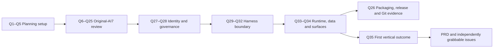

# Decision Map

Status: **complete — all 36 questions resolved or explicitly deferred**

The revised estimate was **36 questions**. Question 36 was added when Question 29 exposed the need for AI7-owned quality measurement; its separate evaluation gate was later superseded by ADR 0027 while the Quality Signals and metrics remain accepted. Question 6 replaced the all-at-once inheritance approval with a topic-by-topic review of original-AI7 documentation. Questions 7–12 resolved the product spine, Editorial Dimensions, learning scopes, and Series. Question 13 accepted the memory-promotion model and added auditable end-to-end Learning Lineage plus an adaptive policy for future material eligibility. The Owner also fixed the purpose of DeepSeek Harness: learn and use its framework to improve Agent Behavior without model training; Question 29 settled the exact capability/profile boundary. Harness-document choices remain architecture-maintainer decisions. The completed interview is design history, not implementation or external-action authority.

## Branch A — Planning mechanics

| Question | Decision | Recommended answer | Status | Blocks |
| --- | --- | --- | --- | --- |
| 1 | Issue tracker for this new repo | GitHub Issues | **Accepted: GitHub Issues** | Skill/project setup and later PRD/issues workflow |
| 2 | External PRs as an incoming request surface (only if GitHub/GitLab) | No initially | **Accepted: no external PR request surface at this stage** | Triage configuration |
| 3 | Triage label vocabulary | Defaults: `needs-triage`, `needs-info`, `ready-for-agent`, `ready-for-human`, `wontfix` | **Accepted: defaults unchanged** | Agent workflow configuration |
| 4 | Domain-doc layout | Multi-context map separating AI7 Editorial and AI7 Execution vocabularies, with a reserved Word context if ever needed | **Accepted: two active contexts, one deferred Word placeholder, plus a maintained reference glossary** | Glossary and ADR locations |
| 5 | Confirm the canonical project-setup draft | Approve `AGENTS.md`, `docs/agents/*`, `CONTEXT-MAP.md`, and the non-duplicating `GLOSSARY.md` index | **Accepted and written** | Writing canonical setup files |

## Branch B — Original-AI7 document inheritance

| Question | Decision | Recommended answer | Status | Blocks |
| --- | --- | --- | --- | --- |
| 6 | Review scope and cross-cutting disposition | Review original-AI7 topic clusters only; delegate Harness details; preserve/rebaseline development dispatch; rewrite `AGENTS.md`; retain one Standalone product on Windows and macOS; drop the old UI | **Accepted, with later platform/validation supersession** | Row-by-row interview method |
| 7 | Primary user, problem, and end-to-end product story | Chinese-first literary-publishing professional; multi-aspect Book work; unpublished-material control; manuscript plus related deliverables | **Accepted with owner revisions** | Product terms and parity scope |
| 8 | Canonical dimensions of multi-aspect editorial judgment | Keep the proposed eight as defaults; apply only relevant dimensions per task | **Accepted with production-user extension** | Task requirements, evaluations, and journey acceptance |
| 9 | Ownership and versioning of user-configurable Editorial Dimensions | Reusable Editorial Profile defaults, Book-level selection/overrides, task-start snapshot; stable IDs and no retroactive history changes | **Accepted** | Configuration model and reproducibility |
| 10 | Book boundary and Cross-project workspace | Book-scoped text authority; explicit direct Cross-project scope; separate corpus-wide learning seam | **Accepted with learning requirement** | Editorial context and storage |
| 11 | Cross-corpus learning representation boundary | Versioned, inspectable House Editorial Memory of derived patterns/feedback; provenance; no raw cross-Book text or hidden fine-tuning by default | **Accepted with Series exception** | Memory architecture and source isolation |
| 12 | Series membership and shared-information boundary | Explicit membership; versioned Series Knowledge; exact read-only retrieval across member Books; Book-targeted mutations and revision provenance | **Accepted** | Series continuity and source authority |
| 13 | Learning signals and update governance | Explicit instructions activate; operational feedback becomes evidence; inferred patterns remain candidates; cross-Book promotion requires approval; rollback/forget/version snapshots | **Accepted with audit requirement** | Adaptation loop and user control |
| 14 | Learning Audit Log and descendant-impact contract | Append-only lineage from material through eligibility, signals, candidates, memory, and task use; user include/exclude controls; dependency-aware correction | **Accepted** | Explainability and remediation |
| 15 | Adaptive Learning Eligibility Policy authority and revision governance | Recommendation-first bounded decisions; Policy Document; post-run agent revisions; non-expansive in-envelope calibration may auto-activate after gates; authority changes need the user | **Accepted** | Material selection and meta-learning |
| 16 | Textual source of record, factual/semantic verification, search/exact retrieval, generation, citation, and grounding | Exact text is authoritative only for what a revision says; test its assertions against separate evidence; identify errors and create Correction Proposals; retain Search → Exact Fetch → Synthesis → typed verification | **Accepted, including configurable evidence authority and conflict handling** | Capability and evidence design |
| 17 | Manuscript blocks, revisions, branches, merge, journal, and recovery | Keep stable blocks, immutable revision DAG, edit journal/checkpoint split, proposal branches, conservative merge, no-partial-apply, and verified recovery; relocate/drop legacy machinery | **Accepted** | Manuscript architecture |
| 18 | Generated proposals, approvals, effects, receipts, and replay safety | Split named authorities; one accept/apply interaction may create distinct Proposal Decision and Effect Approval; keep exact Effect identity, staged/atomic publication, receipt replay, and ambiguous-outcome stop | **Accepted** | Mutation and safety model |
| 19 | Publication lifecycle and editorial artifact family | Keep Book authority but move workflow state to each deliverable; use seven shared phases, four V1 profiles, immutable Editorial Deliverable Revisions, typed artifacts, profile-defined gates, destination-independent packages, versioned maintenance, and narrow commands | **Accepted; refined by Issue #8 Batch 5** | Product scope |
| 20 | Agentic autonomy, visible plans, Task Composer, and workbench outcomes | Make the visible plan an authority-bearing envelope with bounded adaptation; keep exact context/durable outcomes, discard UI parity | **Accepted** | Product interaction model |
| 21 | Task Skill, capability, trust, provider, and secret concepts | Keep layered manifest/trust/capability/provider authority; project instruction into Harness while AI7 owns activation/enforcement | **Accepted** | Skill/provider architecture |
| 22 | Task Intent, Run, Operation, Event, Checkpoint, and lifecycle commands | Use a Task Ledger plus canonical Harness Session Ledger; retire Operation/`operationRuns`, split their business facts by owner, and correlate exact execution spans | **Accepted** | Persistence and control-plane ownership |
| 23 | Standalone/Word parity, exact host binding, drift, and synchronization | Ship Standalone-only V1; make professional editing release-critical; defer Word as an evidence-triggered future alternative | **Accepted with owner revision** | Standalone architecture and journeys |
| 24 | Exact verification boundary | One logical provider-free E2E Functional Gate runs the same complete supported journeys and observed-bug regressions on Windows and macOS through the launchable product path; no request-fingerprint, replay, release-receipt, separate layer, package, platform, performance, editor, or proof gate | **Accepted after ADR 0027/0028 supersession** | Testing strategy |
| 25 | Local development multi-agent dispatch contract | Three roles — Commander, Worker, independent Reviewer; Codex normally commands at top capability; eligible bounded Workers use Claude first with bidirectional same-class fallback; reviewer task class at least that of the work reviewed, cross-provider by default; provider-neutral operating rules with Layer B as the sole provider-specific policy surface; legacy pilot and host connector rejected as baselines | **Accepted with owner revisions** | Repository-agent runbook |
| 26 | Legacy implementation, data, packaging, release, and Git-specific documentation | **Accepted.** Data boundary from Question 22; release channels revised to zip portable plus NSIS installer from one electron-builder configuration, with signing deferred until explicitly requested; binding Git conventions written to `docs/agents/git-conventions.md`; residual matrix rows confirmed as governed or deferred | Migration and repository governance — **resolved** |

## Branch C — Repository identity and governance

| Question | Decision | Recommended answer | Blocks |
| --- | --- | --- | --- |
| 27 | New repo visibility, license, and authority to reuse private AI7 assets | **Accepted.** Private repository; proprietary `LICENSE`, all rights reserved to the sole rights-holder; predecessor asset reuse authorized; manuscripts never enter a repository or hosted CI. Any model-provider transmission is controlled processing governed by the concrete Provider Processing Policy, not public release. Active v1 has exactly zero provider allow rules; live-provider implementation remains blocked pending a separately authorized provider-specific rule/terms decision and runtime task | Git init/remote, history, source copying — **no longer blocking** |
| 28 | AI7 branding, product-language policy, and relationship to Harness | **Accepted.** The product display name is exactly **AI7**, with no separate Chinese product name. Repository suffixes `-harness`, `-reborn`, `-redesign` are developer-facing development-track markers and carry no product meaning; they are not renamed. Harness is the execution foundation and never user-facing branding, appearing only in third-party notices. All AI7 projects are solely owned, and agents are authorized to modify them | Repository, docs, and release naming — **resolved** |

**Question 27 is closed.** The private repository exists, the proprietary `LICENSE` records sole ownership, and the rights-holder has authorized predecessor asset reuse subject to per-asset provenance, sanitization, and applicable third-party/provider obligations. Manuscripts remain outside that grant and outside every repository.

## Branch D — Harness capability and control-plane boundary

| Question | Decision | Recommended answer | Blocks |
| --- | --- | --- | --- |
| 29 | Meaning of “full Harness capability” after accepting DSH as the Agent Behavior Framework | **Accepted.** Full engine, narrow tool surface: no generic shell, roaming filesystem, or arbitrary network in an editorial Run. Agent Data Root with Run Source Scope nested inside. Editorial and Developer Capability Profiles with no self-service escalation. Everything agent-proposable, but capability expansion never self-activates | Security and profile composition — **resolved** |
| 30 | Upstream consumption strategy | **Accepted.** Exactly pinned public npm packages, no fork and no vendored source; only the subset AI7 needs, never the `@deepseek-ai/dsh` CLI aggregate; exact versions with a committed lockfile; consumed baseline `0.1.0-rc.6` with `0.1.0-rc.5` retained as the audited-but-uninstallable reference; applicable complete journeys remain the only standing verification | Bootstrap and upgrade workflow — **resolved** |
| 31 | Single execution authority | **Accepted.** Harness owns the one agent-loop implementation; AI7 schedules and owns business lifecycle. Instances are not authorities, so parallel Runs across Books plus background work are required behavior. Business scheduling avoids Harness job/schedule/workflow packages; AI7 owns concurrency, usage observation and optional explicit Run Budget Ceiling enforcement. Issue #8 Batch 3 later defaulted that ceiling to `unset` and kept Provider Account Limits external. Learn the framework, not its coding-agent defaults | Runtime ownership — **resolved** |
| 32 | AI7-to-Harness record mapping | Task Ledger and Harness Session Ledger retain separate authority; exact Execution Bindings/Spans correlate them; active Operation records are retired | Persistence/event design; **accepted early by Question 22** |

## Branch E — Runtime, data, surfaces, and proof

| Question | Decision | Recommended answer | Blocks |
| --- | --- | --- | --- |
| 33 | Python and legacy-data posture | **Accepted.** TypeScript and Node throughout with no embedded Python; the legacy Python had zero third-party dependencies and handled DOCX with stdlib zip/XML, so nothing required it. Windows retains zip-portable and NSIS channels; macOS mechanics remain separately deferred. Protected secrets stay outside copied product data | Process topology, packaging, storage — **resolved** |
| 34 | Standalone shell and professional editor topology | **Accepted.** Long Chinese manuscripts are required at the 500K, 1M, and 10M tiers; the renderer never holds a whole manuscript. One Windows/macOS Electron product uses a thin main process, renderer, separate AI7 Node service, private local IPC with no TCP listener, and ProseMirror over bounded windows | Client, editor, gateway, packaging — **resolved** |
| 35 | First tracer direction | The earlier spike, read-only grounded-Q&A tracer, and thirteen-point gate are historical under ADR 0027. The first authorized implementation tracer is the bounded provider-free J-01 new-Book happy path from public-synthetic DOCX through Review Before Import, atomic records, a bounded window, and a confirmed durable Edit Journal; it is not full J-01 | **Superseded and reauthorized by the current Owner instruction** | Implementation planning — **resolved for the bounded tracer** |

## Branch F — Editorial quality measurement

| Question | Decision | Recommended answer | Blocks |
| --- | --- | --- | --- |
| 36 | Automated editorial quality metrics | **Accepted.** Three Quality Signal families captured globally on the local instance and attributed per Book/editor/house; five derived metrics with workload displacement as phase-weighted edit volume and time tracking rejected; N = 0 cold start required with sample size gating auto-activation only; actively queried non-blocking one-click reason chips with anti-steering mitigations; privacy as an egress boundary rather than an identity boundary; editor decisions the oracle for taste but never for factual correctness. No separate Behavior Evaluation Gate survives ADR 0027 | Agent Behavior Improvement — **resolved** |

## Dependency view

## Current question

Questions 1–36 are closed or explicitly deferred, and later accepted supersessions are reflected above. The product spine, learning scopes, policy and factual authority, manuscript-native history/recovery, named proposal/Effect authority, deliverable workflows, bounded-plan autonomy, layered Task Skill/capability/provider authority, linked ledgers, one-product Windows/macOS Standalone scope, and DSH-first execution boundary form the accepted `dev` design baseline. No action follows merely because a decision appears here; use the active Issue and Change Brief.

**Question 24 is closed.** It was first asked with a four-tier proposal and answered with a correction rather than an acceptance:

> The ubuntu setup is just for github actions. The target platform is just windows-only. We do not need a production for ubuntu at this stage. And the tiered verification/build/test should be concise and quick

It was historically re-proposed under those constraints and accepted as two Windows-only workflows. That answer is now superseded by ADR 0027's one logical provider-free E2E Functional Gate on Windows and macOS and ADR 0028's one-product platform scope. ADR 0049 newly bounds hosted invocation through Draft suppression, local debugging, integration-ready execution and same-PR cancellation without restoring the old tiers. The quoted owner statement remains decision-history evidence, not current scope.

**Question 25 is closed.** Repository Development Dispatch is three roles with provider-neutral operating rules and one provider-specific Layer B binding policy, recorded in [27-repository-development-dispatch.md](./27-repository-development-dispatch.md) and [ADR 0015](../docs/adr/0015-provider-neutral-development-dispatch.md). The legacy orchestration pilot and its host connector are rejected as baselines and remain old-repository evidence.

**Question 26 is closed.** Legacy-data transfer is allowlist-only; Windows uses zip portable and NSIS channels from one builder/source; signing remains deferred until explicitly requested. macOS distribution mechanics remain a bounded later platform decision, not an unresolved product-scope question.

**Question 27 is closed.** AI7 is proprietary with all rights reserved to the sole rights-holder, and predecessor asset reuse is authorized. Manuscripts remain excluded from repositories and hosted CI. A configured model call would be controlled processing under the concrete Provider Processing Policy, distinct from public release. Active v1 has exactly zero provider allow rules; live-provider implementation remains blocked pending a separately authorized provider-specific rule/terms decision and runtime task. See [ADR 0016](../docs/adr/0016-proprietary-license-and-local-only-sample-manuscripts.md) and the `LICENSE`. Source copying is unblocked subject to per-asset provenance, sanitization, and applicable provider/third-party terms.

**Question 28 is closed.** The product display name is exactly AI7. Repository suffixes are developer-facing track markers with no product meaning, so `ai7-harness` needs no rename and future agents should not "correct" it. Harness stays the execution foundation and never appears as user-facing branding. Branch C — repository identity and governance — is now fully resolved. This was recorded in the decision map rather than an ADR: it is a routine planning answer, not a hard-to-reverse trade-off.

**Question 29 is closed**, resolving the last unaddressed Critical risk-register entry about generic tool exposure. See [28-harness-capability-and-authority-boundary.md](./28-harness-capability-and-authority-boundary.md), [ADR 0017](../docs/adr/0017-full-engine-narrow-tool-surface.md), and [ADR 0018](../docs/adr/0018-tiered-activation-for-agent-authored-revisions.md).

**Question 36 is closed.** The metric system remains accepted in [29-editorial-quality-metrics.md](./29-editorial-quality-metrics.md) and [ADR 0019](../docs/adr/0019-editorial-quality-metrics-and-behavior-evaluation-gate.md); ADR 0027 supersedes its separate gate while retaining product metrics and governed activation behavior.

**Question 30 is closed.** AI7 consumes an exactly pinned subset of public Harness packages, recorded in [30-upstream-consumption-and-upgrade-contract.md](./30-upstream-consumption-and-upgrade-contract.md) and [ADR 0020](../docs/adr/0020-consume-pinned-harness-package-subset.md). The last of the five original implementation blockers other than the Standalone topology is now cleared.

**Question 31 is closed**, recorded in [31-single-execution-authority.md](./31-single-execution-authority.md) and [ADR 0021](../docs/adr/0021-single-execution-authority.md). Branch D is now fully resolved.

**Question 33 is closed**, recorded in [32-runtime-language-and-release-channel.md](./32-runtime-language-and-release-channel.md), [ADR 0022](../docs/adr/0022-typescript-only-runtime.md), and [ADR 0023](../docs/adr/0023-portable-release-with-self-contained-data-root.md). It also settled the release-channel half of Question 26.

**Question 34 is closed**, recorded in [33-standalone-shell-and-editor-topology.md](./33-standalone-shell-and-editor-topology.md), [ADR 0024](../docs/adr/0024-electron-shell-with-isolated-ai7-service.md), and [ADR 0025](../docs/adr/0025-windowed-editing-over-a-paging-manuscript-store.md). The last implementation blocker is cleared.

**Question 26 is closed**, the last open row. Packaging revised to two Windows channels, signing deferred, Git conventions written, residual rows confirmed. **Question 35 is closed as design history** in [34-first-tracer-slice.md](./34-first-tracer-slice.md) and [ADR 0026](../docs/adr/0026-manuscript-retrieval-returns-candidates.md); the current authorized implementation target is instead the bounded provider-free J-01 new-Book happy path recorded in the current development handoff.

**The design interview is complete.** All thirty-six questions are resolved or explicitly deferred. Question 32 was settled early by Question 22; Question 26 was resolved in three parts across Questions 22, 33, and 26 itself.

## Later Issue #8 refinements

Issue #8 Batch 4 preserves the original Question 12 answer while making its previously implicit lifecycle exact: Book-owned Source Versions require explicit Book-targeted acquisition; editor-authored or provenance-bound Series Knowledge Candidates require one explicit conflict-aware promotion review to create a stable Series Knowledge Item with its first immutable revision or append a revision to an exact existing item; and versioned Series Retrieval Exclusions immediately block later affected Series reads, suspending an affected Run for Plan Revision plus renewed authorization or cancellation without rewriting historical records. See [ADR 0035](../docs/adr/0035-require-explicit-book-targeted-source-acquisition.md), [ADR 0036](../docs/adr/0036-promote-series-knowledge-through-explicit-review.md), and [ADR 0037](../docs/adr/0037-enforce-versioned-series-retrieval-exclusions-immediately.md).

Issue #8 Batch 5 refines Question 19 without adding external-delivery authority. A Delivery Package is one versioned destination- and format-independent manifest bound to an exact immutable Editorial Deliverable Revision, optionally identified by an exact Milestone Version. Every concrete local file instead has its own Local Export Preparation, exact AI7 Effect Approval before commit, and per-file receipt after native-OS rename/cancel/replace resolution; cancellation attempts no Effect, ambiguity stops retry, and no receipt proves sending or publication. Post-designation work is preserved as immutable Maintenance Case Revisions under one stable `correction / 更正`, `errata / 勘误`, `supersession / 替代`, `withdrawal / 撤回`, `reissue / 再版`, or `archive / 归档` classification, without rewriting earlier versions or implying external recall. See [ADR 0038](../docs/adr/0038-separate-delivery-package-identity-from-local-export.md), [ADR 0039](../docs/adr/0039-delegate-local-export-collisions-to-native-os-workflows.md), and [ADR 0040](../docs/adr/0040-preserve-post-designation-maintenance-as-versioned-cases.md).

The safe sequence after baseline normalization is a separately scoped Provider Processing / External Export policy baseline, then an implementation-planning Issue that locks the supported development-host matrix, exact toolchain, and dependency provenance, then the bounded provider-free J-01 new-Book happy-path tracer. This document grants none of those later Issues authority by itself.
