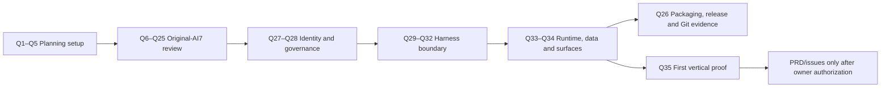

# Decision Map

Status: **complete — all 36 questions resolved or explicitly deferred**

The revised estimate is **36 questions**. Question 36 was added when Question 29 established that agent-authored revisions require an evaluation gate that AI7 must own. Question 6 replaced the all-at-once inheritance approval with a topic-by-topic review of original-AI7 documentation. Questions 7–12 resolved the product spine, Editorial Dimensions, learning scopes, and Series. Question 13 accepted the memory-promotion model and added two distinct requirements: auditable end-to-end learning lineage and an adaptive policy for future material eligibility. The owner has also fixed the purpose of DeepSeek Harness: learn and use its framework to improve Agent Behavior without model training; Question 29 still decides the exact capability/profile boundary. Harness-document choices are delegated to the architecture maintainer. Questions are asked one at a time; code/source facts are investigated rather than asked.

## Branch A — Planning mechanics

| Question | Decision | Recommended answer | Status | Blocks |
| --- | --- | --- | --- | --- |
| 1 | Issue tracker for this new repo | GitHub Issues | **Accepted: GitHub Issues** | Skill/project setup and later PRD/issues workflow |
| 2 | External PRs as an incoming request surface (only if GitHub/GitLab) | No initially | **Accepted: no external PR request surface at this stage** | Triage configuration |
| 3 | Triage label vocabulary | Defaults: `needs-triage`, `needs-info`, `ready-for-agent`, `ready-for-human`, `wontfix` | **Accepted: defaults unchanged** | Agent workflow configuration |
| 4 | Domain-doc layout | Multi-context map separating AI7 Editorial and AI7 Execution vocabularies, with a reserved Word context if ever needed | **Accepted: two active contexts, one deferred Word placeholder, plus a maintained reference glossary** | Glossary and ADR locations |
| 5 | Confirm the canonical project-setup draft | Approve `AGENTS.md`, `docs/agents/*`, `CONTEXT-MAP.md`, and the non-duplicating `GLOSSARY.md` index | **Accepted and written** | Writing canonical setup files |

## Branch B — Original-AI7 document inheritance

| Question | Decision | Recommended answer | Status | Blocks |
| --- | --- | --- | --- | --- |
| 6 | Review scope and cross-cutting disposition | Review original-AI7 topic clusters only; delegate Harness details; preserve/rebaseline tests and development dispatch; rewrite `AGENTS.md`; drop old UI. The original Windows-only target was superseded on 2026-08-21 by Windows and macOS. | **Accepted; platform clause superseded by ADR 0027** | Row-by-row interview method |
| 7 | Primary user, problem, and end-to-end product story | Chinese-first literary-publishing professional; multi-aspect Book work; unpublished-material control; manuscript plus related deliverables | **Accepted with owner revisions** | Product terms and parity scope |
| 8 | Canonical dimensions of multi-aspect editorial judgment | Keep the proposed eight as defaults; apply only relevant dimensions per task | **Accepted with production-user extension** | Task requirements, evaluations, and journey acceptance |
| 9 | Ownership and versioning of user-configurable Editorial Dimensions | Reusable Editorial Profile defaults, Book-level selection/overrides, task-start snapshot; stable IDs and no retroactive history changes | **Accepted** | Configuration model and reproducibility |
| 10 | Book boundary and Cross-project workspace | Book-scoped text authority; explicit direct Cross-project scope; separate corpus-wide learning seam | **Accepted with learning requirement** | Editorial context and storage |
| 11 | Cross-corpus learning representation boundary | Versioned, inspectable House Editorial Memory of derived patterns/feedback; provenance; no raw cross-Book text or hidden fine-tuning by default | **Accepted with Series exception** | Memory architecture and source isolation |
| 12 | Series membership and shared-information boundary | Explicit membership; versioned Series Knowledge; exact read-only retrieval across member Books; Book-targeted mutations and revision provenance | **Accepted** | Series continuity and source authority |
| 13 | Learning signals and update governance | Explicit instructions activate; operational feedback becomes evidence; inferred patterns remain candidates; cross-Book promotion requires approval; rollback/forget/version snapshots | **Accepted with audit requirement** | Adaptation loop and user control |
| 14 | Learning Audit Log and descendant-impact contract | Append-only lineage from material through eligibility, signals, candidates, memory, and task use; user include/exclude controls; dependency-aware correction | **Accepted** | Explainability and remediation |
| 15 | Adaptive Learning Eligibility Policy authority and revision governance | Recommendation-first bounded decisions; Policy Document; post-run agent revisions; non-expansive in-envelope calibration may auto-activate after gates; authority changes need the user | **Accepted** | Material selection and meta-learning |
| 16 | Textual source of record, factual/semantic verification, search/exact retrieval, generation, citation, and grounding | Exact text is authoritative only for what a revision says; verify quotations against it; cite source-derived facts; require timestamped evidence for current/external facts; label editorial judgment; verify factual subclaims inside creative/promotional synthesis; retain Search → Exact Fetch → Synthesis → typed verification | **Accepted; all five content/evidence rules explicitly confirmed 2026-08-21** | Capability and evidence design |
| 17 | Manuscript blocks, revisions, branches, merge, journal, and recovery | Keep stable blocks, immutable revision DAG, edit journal/checkpoint split, proposal branches, conservative merge, no-partial-apply, and verified recovery; relocate/drop legacy machinery | **Accepted** | Manuscript architecture |
| 18 | Generated proposals, approvals, effects, receipts, and replay safety | Split named authorities; one accept/apply interaction may create distinct Proposal Decision and Effect Approval; keep exact Effect identity, staged/atomic publication, receipt replay, and ambiguous-outcome stop | **Accepted** | Mutation and safety model |
| 19 | Publication lifecycle and editorial artifact family | Keep Book authority but move workflow state to each deliverable; use seven shared phases, four V1 profiles, typed artifacts, profile-defined gates, and narrow commands | **Accepted** | Product scope |
| 20 | Agentic autonomy, visible plans, Task Composer, and workbench outcomes | Make the visible plan an authority-bearing envelope with bounded adaptation; keep exact context/durable outcomes, discard UI parity | **Accepted** | Product interaction model |
| 21 | Task Skill, capability, trust, provider, and secret concepts | Keep layered manifest/trust/capability/provider authority; project instruction into Harness while AI7 owns activation/enforcement | **Accepted** | Skill/provider architecture |
| 22 | Task Intent, Run, Operation, Event, Checkpoint, and lifecycle commands | Use a Task Ledger plus canonical Harness Session Ledger; retire Operation/`operationRuns`, split their business facts by owner, and correlate exact execution spans | **Accepted** | Persistence and control-plane ownership |
| 23 | Standalone/Word parity, exact host binding, drift, and synchronization | Ship Standalone-only V1; make professional editing release-critical; defer Word as an evidence-triggered future alternative | **Accepted with owner revision** | Standalone architecture and journeys |
| 24 | Exact verification tiers and generated mock-provider corpus | Keep only `pr` and `release`, provider-free required CI, local focused/rehearsal modes, request-fingerprint guard, regenerated corpus, and concise receipts. The old single `windows-2025` job is superseded; the smallest required Windows/macOS evidence topology is open. | **Accepted core; platform topology reopened by ADR 0027** | Testing strategy |
| 25 | Local development multi-agent dispatch contract | Three roles — Commander, Worker, independent Reviewer; Codex normally commands at top capability; workers prefer Claude with bidirectional fallback; reviewer task class at least that of the work reviewed, cross-provider by default; provider-neutral operating rules with one binding table as the sole provider-specific artifact; legacy pilot and host connector rejected as baselines | **Accepted with owner revisions** | Repository-agent runbook |
| 26 | Legacy implementation, data, packaging, release, and Git-specific documentation | Data boundary from Question 22; Windows zip portable plus NSIS channels; Windows signing deferred; binding Git conventions; residual rows governed or deferred. macOS packaging, data, signing/notarization, and release evidence are new open work. | **Accepted for legacy/Windows scope; macOS release scope reopened by ADR 0027** | Migration and repository governance |

## Branch C — Repository identity and governance

| Question | Decision | Recommended answer | Blocks |
| --- | --- | --- | --- |
| 27 | New repo visibility, license, and authority to reuse private AI7 assets | **Accepted.** Private repository; proprietary `LICENSE`, all rights reserved to the sole rights-holder; predecessor asset reuse authorized; sample manuscripts authorized for AI7 use while kept out of repositories and public channels. Sending them to a configured Model Provider is permitted controlled processing. | Git init/remote, history, source copying — **no longer blocking** |
| 28 | AI7 branding, product-language policy, and relationship to Harness | **Accepted.** The product display name is exactly **AI7**, with no separate Chinese product name. Repository suffixes `-harness`, `-reborn`, `-redesign` are developer-facing development-track markers and carry no product meaning; they are not renamed. Harness is the execution foundation and never user-facing branding, appearing only in third-party notices. All AI7 projects are solely owned, and agents are authorized to modify them | Repository, docs, and release naming — **resolved** |

**Question 27 is resolved.** The repository is private, AI7 is proprietary under
the recorded sole rights-holder, and predecessor reuse is authorized subject to
the asset-level provenance, manuscript, sanitization, and third-party terms
boundaries. Repository initialization still ran ahead of the documented Phase 0
exit gate; that sequencing fact does not imply Phase 0 passed.

## Branch D — Harness capability and control-plane boundary

| Question | Decision | Recommended answer | Blocks |
| --- | --- | --- | --- |
| 29 | Meaning of “full Harness capability” after accepting DSH as the Agent Behavior Framework | **Accepted.** Full engine, narrow tool surface: no generic shell, roaming filesystem, or arbitrary network in an editorial Run. Agent Data Root target with Run Source Scope nested inside. Editorial and Developer Capability Profiles with no self-service escalation. Everything agent-proposable, but capability expansion never self-activates. Per-platform OS enforcement is not yet proven. | Security/profile semantics resolved; platform enforcement open |
| 30 | Upstream consumption strategy | **Accepted.** Exactly pinned public npm packages, no fork and no vendored source; only the subset AI7 needs, never the `@deepseek-ai/dsh` CLI aggregate; exact versions with a committed lockfile; consumed baseline `0.1.0-rc.6` with `0.1.0-rc.5` retained as the audited-but-uninstallable reference; upstream tags/releases, commits, npm versions, and dist-tags tracked together without automatic adoption; SDK/ACP kept as a fallback isolation seam; dedicated upgrade verification | Consumption strategy resolved; rc.5-to-rc.6 selected-seam and two-platform installed-closure audit blocks Phase 0/bootstrap; rc.7/rc.8 not adopted |
| 31 | Single execution authority | **Accepted.** Harness owns the one agent-loop implementation; AI7 schedules and owns business lifecycle. Instances are not authorities, so parallel Runs across Books plus background work are required behavior. Business scheduling avoids Harness job/schedule/workflow packages; AI7 owns a concurrency and budget governor. Learn the framework, not its coding-agent defaults | Runtime ownership — **resolved** |
| 32 | AI7-to-Harness record mapping | Task Ledger and Harness Session Ledger retain separate authority; exact Execution Bindings/Spans correlate them; active Operation records are retired | Persistence/event design; **accepted early by Question 22** |

## Branch E — Runtime, data, surfaces, and proof

| Question | Decision | Recommended answer | Blocks |
| --- | --- | --- | --- |
| 33 | Runtime language, legacy-data posture, and release location | **Accepted.** TypeScript and Node throughout with no embedded Python; Windows zip/NSIS data rules remain accepted. macOS package, data-root, secret-store, and signing policy are open. | Runtime resolved; cross-platform packaging/storage open |
| 34 | Standalone shell and professional editor topology | **Accepted core.** Long Chinese manuscripts have binding 500K/1M/10M tiers; the renderer never holds a whole manuscript. Electron shell, three processes with a separate AI7 service, local no-TCP IPC, and ProseMirror over bounded windows remain. macOS native lifecycle/IPC/input evidence is open. | Core topology resolved; platform proof open |
| 35 | First tracer slice and exit gate | **Accepted core.** Store/index spike, read-only exact-citation tracer, candidate-only manuscript retrieval, revision-aware projections, and deferred retrieval strategy remain. Windows-only gate and portable-folder criteria need supported-platform replacements. | Slice semantics resolved; platform exit criteria open |

## Branch F — Editorial quality measurement

| Question | Decision | Recommended answer | Blocks |
| --- | --- | --- | --- |
| 36 | Automated editorial quality metrics and the Behavior Evaluation Gate | **Accepted.** Three Quality Signal families captured globally on the local instance and attributed per Book/editor/house; five derived metrics with workload displacement as phase-weighted edit volume and time tracking rejected; N = 0 cold start required with sample size gating auto-activation only; actively queried non-blocking one-click reason chips with anti-steering mitigations; privacy as an egress boundary rather than an identity boundary; editor decisions the oracle for taste but never for factual correctness | Agent Behavior Improvement activation — **resolved** |

## Dependency view

## Current status after the interview

The 36-question interview remains complete. On 2026-08-21 the owner explicitly confirmed Question 16's remaining content/evidence rules, closing its only acceptance ambiguity.

On the same date the owner revised the product target from Windows-only to Windows and macOS with a consistent product outlook. This post-interview revision is recorded in [ADR 0027](../docs/adr/0027-support-windows-and-macos-as-one-product.md) and the [platform note](./35-windows-macos-product-platform.md). It partially supersedes the platform clauses of Questions 6, 24, 26, 29, 30, 33, 34, and 35 without reopening their domain, Standalone, runtime-language, or core-topology decisions.

Phase 0 is therefore **not passed**. The exact consistency boundary and the macOS support, packaging/data, signing, credential, confinement, native-evidence, and concise two-platform verification decisions remain open. See the [Phase 0 Exit Review](./36-phase-0-exit-review.md). No PRD or issue decomposition follows automatically; both still require explicit owner authorization.
