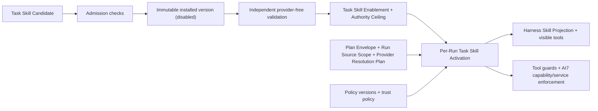

# Task Skill, Capability, Trust, and Provider Boundary

Status: **accepted in Question 21**

## Recommendation

Preserve original AI7's layered Task Skill authority model, not its fragmented runtime or discarded UI. A **Task Skill** is an immutable declarative workflow package that may request AI7 Capabilities, source scopes, Model Roles, and named Effect gates. Installation admits exact bytes; enablement establishes the maximum authority that version may request; an exact Task Skill Activation intersects that ceiling with the task's Plan Envelope, Run Source Scope, Provider Resolution Plan, credentials, and current Policy Documents. The AI7 capability boundary independently enforces the resulting authority, and each high-impact Effect still requires its own named authority.

For DeepSeek Harness, one Task Skill projects into:

1. one instructional **Harness Skill Projection** for catalog/routing/context; and
2. one AI7-owned immutable **Task Skill Activation** for authority and replay.

It does not become a Cordis Plugin, bundle, preset, MCP endpoint, credential, or authority grant. Code-bearing Capability Implementations are installed separately as pinned static Cordis plugins/bundles. Loading or authoring a Task Skill never installs or mounts code.

## Pinned source evidence

Audit pins:

- `ai7-reborn-ai@3e6e9ac772b7f07832154fa39d7de8a4deca51b1`
- `deepseek-harness@47f943859bef60e4160492346772ded9b24f765a`

### Original-AI7 current truth

| Area | Current truth at the pin | Migration finding |
| --- | --- | --- |
| Task Skill concept | ADR 0003 defines a first-class package of instructions, permissions, schemas, policy, and validation rather than a prompt fragment. | Keep the product concept. |
| Manifest | ADR 0026 and `runtime/task_skill_orchestrator.py` implement identity/version, capabilities, source scope, Model Roles, schemas, approval policy, Run scope, compatibility, and evidence. | Keep semantics; redesign the schema around accepted named authorities and remove UI ownership. |
| Bundled catalog | Thirteen bundled skills are cataloged runnable and the inventory says all graduated. | Preserve as legacy capability evidence, not proof of one coherent extensibility runtime or professional behavior quality. |
| Local-skill lifecycle | Staging, immutable install, provider-free validation, enable/disable, update, and uninstall are shipped and extensively tested. | Keep lifecycle semantics and content-addressed identity. |
| Local-skill execution | Current tests explicitly state enabled managed local skills remain non-runnable until one execution authority exists. | Do not inherit the claim that local-skill authoring is end-to-end complete. |
| Capability boundary | ADR 0014 and the current orchestrator prevent skills from directly accessing files, providers, indexes, exact text, or persistence; effective authority is intersected and rechecked. | Keep strongly, renamed from implementation-bound “Kernel Capability” to AI7 Capability. |
| Handler binding | Runtime rechecks exact skill/version/manifest digest plus implementation digest. | Keep immutable binding; replace Python/reflection machinery. |
| Trust/install | ADRs 0025/0071 derive trust from release/installer provenance, install immutable bytes disabled, validate independently, and review exact permission deltas before enablement. | Keep. An editable manifest cannot assert its own trust. |
| Authoring/promotion | ADR 0082 produces a disabled `local-user` declarative candidate; it cannot self-install, self-enable, mint `builtin.*`, or generate native code. Promotion belongs to repository/release gates. | Keep V1 constraint and separate developer extensions. |
| Source scope | ADRs 0017/0018/0072 default to the active Book; broader access is exact, user-designated, and Run-local. | Keep and align Series/Cross-project behavior with Questions 10–12. |
| Model Roles | ADRs 0023/0024 let skills declare only used roles, hard requirements, and soft preferences—never provider, model, endpoint, or credential. | Keep. |
| Resolution/preflight | ADR 0080 and `runtime/provider_resolution.py` freeze a compatible primary/fallback plan under exact privacy, capability, context, source, outbound-data, budget, and configuration revisions. | Keep semantics inside the accepted Plan Envelope. |
| Credentials | Ordinary configuration accepts only opaque references; the current legacy adapter uses Windows Credential Manager. | Keep references-only; use the AI7 Credential Broker with Windows Credential Manager and macOS Keychain target adapters and per-consumer authorization. |
| Live providers | Current generation explicitly has no live network adapter and uses mock/cassette providers. | Provider governance is substantive, but production live-provider execution is a gap. |
| Historical agent/tool API | Old `/agent/plan`, `/agent/run`, `/agent/approve`, and typed tool registry are reference-only. | Drop the API/runtime; retain bounded typed-operation lessons. |

Hard corrections:

- “Sole orchestrator” is a target invariant, not current truth; execution is fragmented across Q&A, built-ins, publication handlers, and cross-project services.
- A passing provider-free validation proves a defined synthetic contract, not editorial quality, security, or production provider behavior.
- `trustLevel` cannot remain an editable manifest claim.
- `ui.surfaces` belongs to the later independent UI/UX design, not the core Task Skill contract.
- `manuscript-confidential` and `confidentialitySensitive` conflate provider processing, export, and public release; use the accepted proportional policy split below.

### Harness mapping truth

| AI7 concept | Harness projection | Required AI7 ownership |
| --- | --- | --- |
| Task Skill identity/version/body | Harness skill name, description, `whenToUse`, invocation policy, content, resource guidance | Version, digest, immutable package, provenance, trust, and activation pin; Harness bodies are unversioned and body-only changes may be invisible to its catalog. |
| Capability request | Activation selects already installed tools/services | Capability catalog and dependency/compatibility resolution; Harness skill metadata does not enforce dependencies. |
| Tool visibility | Scoped Harness tool catalog | Visibility only. Harness explicitly says restriction is not an authority boundary. |
| Tool execution | Monotonic guards plus pre-execute policy/approval | AI7 must also require activation authority in service/backend facades because direct service calls may bypass tool policy. |
| Capability implementation | Static Cordis Service Provider/plugin installed by an AI7 bundle | Package provenance, pinning, compatibility, inventory, and authority-aware facade. Never overload Harness `SkillProvider`. |
| Trust | Input to AI7 admission and activation policy | Harness skill/preset trust labels are descriptive, not enforcement. User presets are shell-equivalent. |
| Model service | Harness LLM service and per-session configuration | AI7 Model Role resolution, exact Provider Resolution Plan, budget/privacy/source rules, and task pinning. |
| Credential | Harness CredentialRef resolved per operation | AI7 per-skill/capability/consumer broker and OS-protected backend; Harness refs have no consumer ACL. |
| Durable activation | AI7-owned typed Harness Session events | Canonical manifest/ceiling/provider/policy snapshot and replay checks; loading a Harness skill records none of these by itself. |
| MCP | Admin-installed tool implementation may satisfy an AI7 Capability | MCP is not a Task Skill provider; Harness bridges Tools but not MCP Resources or Prompts, and MCP env/header secrets bypass its credential seam. |

## Accepted bilingual domain terms

| English canonical term | Preferred Simplified Chinese | Meaning |
| --- | --- | --- |
| **Task Skill** | 任务技能 | An immutable declarative workflow package that defines editorial purpose, instructions, contracts, requested AI7 Capabilities, eligible scopes, Model Roles, Effect gates, and validation requirements. |
| **Task Skill Manifest** | 任务技能清单文件 | The machine-validatable authority and compatibility contract of one Task Skill package; it requests eligibility but grants nothing by itself. |
| **Task Skill Package** | 任务技能包 | The immutable manifest, instructions, resources, examples, and validation material distributed as one content-addressed unit. |
| **Task Skill Candidate** | 候选任务技能 | A complete non-executing proposed package awaiting independent admission, installation, validation, and enablement. |
| **Task Skill Trust Tier** | 任务技能信任等级 | A provenance-derived class such as bundled or local-user that limits admission and maximum capability, never a manifest self-claim. |
| **Admission State** | 技能准入状态 | The lifecycle state describing whether exact candidate bytes are rejected, installed-disabled, validated, enabled, disabled, or retired. |
| **Installed Task Skill Version** | 已安装任务技能版本 | An immutable app-managed version identified by Task Skill ID, semantic version, and content digest. |
| **Task Skill Enablement** | 任务技能启用状态 | The explicit decision that one validated installed version may request authority up to an exact Authority Ceiling in future tasks. |
| **Authority Ceiling** | 权限上限 | The maximum capabilities, scope kinds, provider needs, and Effect classes a Task Skill version may request; it is not Run Authorization or Effect Approval. |
| **AI7 Capability** | AI7 能力 | A stable governed product operation available only through policy-aware AI7 boundaries, independent of how Harness exposes a tool or service adapter. |
| **Capability Implementation** | 能力实现 | One pinned installed provider of an AI7 Capability, normally hosted as trusted static Cordis code rather than inside a Task Skill. |
| **Capability Grant** | 能力使用许可 | Exact authority for one Task Skill Activation to invoke an AI7 Capability under stated operation and scope constraints. |
| **Task Skill Activation** | 任务技能运行激活 | The immutable per-Run intersection of skill identity, trust/enablement ceilings, Plan Envelope, source/provider scope, policies, capabilities, and credential references. |
| **Harness Skill Projection** | Harness 技能投影 | The non-authoritative instructional/catalog representation of an AI7 Task Skill in the Harness Skill registry. |
| **Run Source Scope** | 任务运行来源范围 | The exact Book, Series, Cross-project, source, and revision read boundary authorized for one Run. |
| **Model Role** | 模型角色 | A provider-independent function actually needed by a Task Skill, such as planner, writer, reviewer, embedder, or reranker. |
| **Model-role Requirement** | 模型角色硬性要求 | A non-negotiable capability, context, policy, or compatibility condition for one used Model Role. |
| **Model-role Preference** | 模型角色偏好 | A quality, cost, or speed ranking applied only after hard user and policy constraints are satisfied. |
| **Model Provider** | 模型服务提供方 | An external or local service offering concrete models through an adapter; it is not a Skill Provider or Capability Implementation. |
| **Provider Binding** | 模型提供方绑定 | The exact Model Provider, model, profile/configuration revision, adapter version, and opaque credential binding used for one role attempt. |
| **Provider Resolution Plan** | 模型服务选用方案 | The immutable preflighted primary binding and ordered compatible fallback bindings for the Model Roles in one Run. |
| **Provider Preflight** | 模型服务预检 | The review that resolves roles and shows bindings, outbound-data category, exact source scope, budget, and blockers before Run Authorization. |
| **Approved Fallback Chain** | 已批准备用链 | The ordered compatible provider bindings already visible and included in the authorized Provider Resolution Plan. |
| **Credential Reference** | 凭据引用 | An opaque identifier for a secret resolved only inside its authorized consumer boundary. |
| **Credential Broker** | 凭据代理服务 | The AI7 service that maps Task Skill Activation, Capability, Run or Domain Command, and logical credential slot to an approved reference and injects the value only at the final consumer. |
| **Protected Secret Store** | 安全凭据库 | The operating-system-protected store that holds secret values behind Credential References and never exposes them to Task Skills or model-visible state. |
| **Outbound Data Category** | 外发数据类别 | A policy-defined classification of the exact content permitted to leave the local AI7 authority for provider processing. |
| **Provider Processing Policy** | 模型服务数据处理策略 | A Policy Document deciding which Outbound Data Categories and scopes may be sent to which configured Model Providers. |
| **External Export Policy** | 对外导出策略 | A Policy Document governing transfer of an exact deliverable, source, or package to a non-provider destination. |
| **Bundled Promotion Gate** | 内置技能晋级关口 | The repository/release process that alone may assign bundled provenance to a validated Task Skill; it is not an in-product trust escalation. |

Avoid unqualified `Provider`: Harness Skill Provider, Capability Implementation, Model Provider, Credential backend, and MCP endpoint are different concepts.

Qualification rules:

- Task Skill Package → Task Skill Candidate → Admission State → Installed Task Skill Version → Task Skill Enablement → Task Skill Activation is a lifecycle, not one overloaded “installed/enabled” flag. Trust Tier is provenance classification, not a lifecycle state.
- AI7 Capability, Capability Implementation, Harness Tool, Harness Skill Projection, and Task Skill are five distinct concepts. A visible tool or loaded projection grants no capability authority.
- Authority Ceiling says what one version can never exceed; Capability Grant says which AI7 Capabilities one activation may use; Execution Grant says whether one guarded step may execute now. None is Effect Approval.
- Run Source Scope controls what this Run may read. It neither permits outbound transmission nor changes Working Corpus or Learning Eligibility.
- Model Role, Model-role Requirement, Model-role Preference, and Provider Binding must remain distinct; hard requirements filter before preferences rank.
- Credential Reference is a non-secret handle; Credential Broker authorizes resolution; Protected Secret Store holds the value.
- Outbound Data Category, Provider Processing Policy, External Export Policy, and Public Release Permission cannot imply one another.

## Manifest boundary

### Keep in the canonical Task Skill Manifest

- stable Task Skill identity and semantic version;
- concise purpose and Task Outcome types;
- input/output schemas;
- required and optional AI7 Capabilities;
- eligible Run Source Scope kinds, explicitly not grants;
- actually used Model Roles, hard requirements, and soft preferences;
- declared Effect classes and named gate requirements;
- minimum Task Skill protocol/API compatibility;
- validation profile and evidence references;
- package resources and integrity references.

### Derive or relocate

- Trust Tier derives from installer/release provenance and signed catalog evidence, never editable manifest text.
- Content digest and installed provenance derive from the exact package bytes and admission receipt.
- Authority Ceiling is the admitted/enabled intersection, not simply the manifest request.
- Presentation hints live in a separate optional host-neutral descriptor owned by the later UI/UX design.
- Implementation/catalog maturity lives in the release inventory, not the executable authority contract.
- Question 22 later accepted Run Records in the Task Ledger linked through Execution Bindings to the Harness Session Ledger, while retiring active Operation records and the legacy `runRecordScope` shape.
- Fixed five-field `approvalPolicy` becomes capability- and Effect-specific named gate declarations.

V1 local-user Task Skills remain declarative: they cannot contain native TypeScript/Python, arbitrary Cordis configuration, custom frontend code, shell hooks, MCP commands, runtime profile edits, or model-written executable workflows. A developer may install a separately reviewed Capability Implementation; this does not elevate the Task Skill's trust or authority.

## Admission, enablement, and activation



Initial Trust Tiers are only:

- `bundled` — delivered through the AI7 release and Bundled Promotion Gate;
- `local-user` — user- or agent-authored declarative package admitted locally.

Rejected, installed, validated, enabled, disabled, and retired are Admission States, not trust levels. Signed community/marketplace distribution is deferred; arbitrary code belongs to a separate future developer-extension policy, not a weaker `local-user` rule.

Task Skill authoring may generate and repair a candidate, but its own Run is not independent validation. It cannot install, enable, approve, promote, or activate its output. Updates create new immutable versions; disabling or uninstalling never erases historical identity, decisions, Runs, or outcomes.

## Effective authority

```text
installer/release provenance
  ∩ trust-tier policy
  ∩ manifest request ceiling
  ∩ enabled-version Authority Ceiling
  ∩ Task Intent and Plan Envelope
  ∩ exact Run Source Scope
  ∩ frozen Provider Resolution Plan
  ∩ active Policy Documents and runtime constraints
  = Task Skill Activation and Capability Grants
```

Enforcement occurs at three independent points:

1. **Admission** rejects malformed, incompatible, unknown-provenance, or over-privileged packages before activation.
2. **Harness tool execution** uses scoped visibility, monotonic hard-denial guards, pre-execute policy, and interactive requests.
3. **AI7 capability/service execution** requires the exact Task Skill Activation and Capability Grant at filesystem, process, network, provider, credential, and durable-state facades.

The third point is mandatory because Harness tool visibility, agent scope, prompt instruction, plan mode, and skill/preset trust labels are not security boundaries. A Cordis plugin calling a service directly must not bypass AI7 policy.

Task Skill Enablement permits only future requests up to an Authority Ceiling. Run Authorization permits only the exact Plan Envelope and Run Source Scope. Neither grants Effect Approval, Proposal Decision, Review Decision, or Public Release Permission.

## Provider and credential boundary

1. A Task Skill declares only used Model Roles plus hard requirements and soft preferences.
2. User-owned resolution precedence is explicit per-Run override, then the owning Book or Cross-project configuration, then global configuration.
3. Provider Preflight freezes the compatible primary and Approved Fallback Chain inside the Plan Envelope.
4. Only conclusive failure may advance within that chain; an Ambiguous External Outcome stops fallback and retry.
5. A provider outside the plan, wider data/source scope, or higher budget requires a Plan Revision and renewed Run Authorization.
6. Credential values never appear in Task Skill packages, Cordis config, prompts, generic environment maps, Session text, tool schemas/results, diagnostics, or client-facing settings. The Credential Broker resolves an opaque reference only inside the final authorized adapter/capability consumer.

Harness's credential reference and per-operation resolution seam are useful, but its flat namespace has no per-skill/consumer ACL and its local file store is not an OS keychain. AI7 therefore wraps it with per-consumer authorization and a platform Protected Secret Store backend: Windows Credential Manager or macOS Keychain. MCP literal environment/header secrets are prohibited unless adapted through this broker.

## Proportional unpublished-material boundary

Provider processing, external export, and public release are three separate policies:

- **Provider Processing Policy** controls whether exact material may be sent to one configured Model Provider under a Run Authorization.
- **External Export Policy** controls an Effect that transfers exact material to a named non-provider destination.
- **Public Release Permission** controls making exact Unpublished Editorial Material accessible to the public.

A configured provider call is controlled processing, not public release. It should not require a second prompt for every model call inside an unchanged Plan Envelope, but the Provider Preflight must expose the provider, exact Run Source Scope, and Outbound Data Category. The initial policy categories are:

- `public-or-synthetic` — 公开或合成内容;
- `unpublished-metadata` — 未公开材料元数据;
- `unpublished-excerpts` — 未公开材料选段;
- `unpublished-full-content` — 未公开材料全文.

Credentials are never an Outbound Data Category. They are prohibited from model-visible or general outbound content and may be injected only into the authorized protocol boundary.

## Keep / adapt / drop

| Legacy element | Recommendation | New-project treatment |
| --- | --- | --- |
| First-class Task Skill and rich manifest | Keep/adapt | AI7-owned declarative package and authority request contract. |
| Exact version/digest/implementation binding | Keep semantics | Immutable Task Skill Package plus separately pinned Capability Implementations. |
| Kernel-mediated capability boundary | Keep/rename | AI7 Capability with tool and service enforcement; no direct host access. |
| Staged trust, immutable install, validation, enablement | Keep | Provenance-derived Trust Tier, lifecycle Admission State, digest-bound Authority Ceiling. |
| Local declarative skill authoring | Keep with gap label | Candidate creation is useful; new implementation must close the activation path. |
| Active-Book default and exact Run-local broader scope | Keep | Run Source Scope aligned with Book/Series/Cross-project decisions. |
| Model Roles, hard requirements, soft preferences | Keep | User-owned Provider Resolution Plan; skills never name providers or secrets. |
| Frozen fallback, drift, ambiguous-outcome behavior | Keep | Part of Plan Envelope, Effect/replay, and provider policies. |
| Opaque credential references and OS protection | Keep/deepen | AI7 Credential Broker plus Windows Credential Manager/macOS Keychain backends and per-consumer ACL. |
| `ui.surfaces`, forms, skill cards, settings layouts | Drop from manifest authority | Separate later UI/UX descriptor and design. |
| `trustLevel`, `implementationStatus` as editable manifest fields | Drop/derive | Installer/release/catalog projections only. |
| Fixed generic `approvalPolicy` block | Replace | Named capability/Effect gate declarations compatible with Questions 18–20. |
| `manuscript-confidential` umbrella | Replace | Provider processing, External Export Policy, and Public Release Permission. |
| Existing Python/JSON package shape and fragmented orchestrators | Drop as architecture | Preserve behavioral contracts through AI7/Harness seams. |
| Current local-skill runnable or live-provider completeness claims | Drop | Both are verified legacy gaps. |
| Dynamic Cordis self-modification, runtime patches, user presets, arbitrary MCP/shell/code workflows in Task Skills | Developer-only/defer | Never activated merely by loading or authoring a production Task Skill. |

## Provider-free verification direction

Required deterministic tests should prove manifest/schema/integrity validation; provenance-derived trust; immutable installation/update; independent authoring versus validation; exact enablement ceiling and permission deltas; per-Run activation intersection; no local-skill native code; no plugin installation through skill load; tool-visibility versus service-authority enforcement; exact source-scope pins; Model Role resolution and hard-before-soft ranking; frozen fallback and ambiguous-outcome stop; Plan Revision on drift; opaque credentials/no secret leakage; provider/export/public-release separation; activation/session replay; and accurate gap/maturity reporting. Live-provider rehearsal remains separate, synthetic, explicitly authorized evidence.

## Decision resolution

Question 21 accepted the layered Task Skill package/admission/enablement/activation model, separate Capability Implementations, Harness instructional projection, model-role/provider-resolution boundary, opaque brokered credentials, proportional provider-processing/export/public-release split, and the full keep/adapt/drop disposition above. See [ADR 0010](../docs/adr/0010-separate-task-skill-instruction-implementation-and-authority.md).
