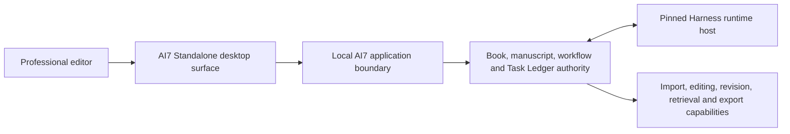

# Standalone-only V1 and Deferred Word Alternative

Status: **accepted in Question 23 with owner revision**

## Decision

The new AI7 V1 is a **Standalone-only Windows-and-macOS desktop product**. Microsoft Word integration is excluded from V1 scope: it is not a surface, parity target, runtime dependency, packaging component, verification gate, or first-release deliverable.

Word remains only a deferred contingency if the Standalone Editing Sufficiency Gate fails and diagnosis shows that live Word integration is the proportionate remedy for a genuinely Word-dependent publishing workflow. A future Word surface requires a new explicit scope/architecture decision; gate failure alone never adds it.

The old Standalone experience is negative design evidence: its editor, renderer, workbench layout, components, and interaction model are not reused. “Standalone-only” therefore does not mean accepting the old editor—it makes a strong new Standalone editing experience a product requirement.

## V1 architecture boundary

V1 has one user-facing product surface and one AI7 business authority. Harness may supply Host/Client composition, agent Sessions, tools, profiles, and projections, but it does not own the manuscript editor, document model, Book identity, revision graph, or editing UX.

The exact desktop shell, editor framework, rendering technology, and client/Host process topology remain later design choices. No choice may bypass the accepted Manuscript History, Proposal Branch, Task Ledger, Effect, Policy Document, source-scope, or learning boundaries.

## Pinned original-AI7 evidence

Audit pin: `ai7-reborn-ai@3e6e9ac772b7f07832154fa39d7de8a4deca51b1`.

The source documents do not support treating the old Standalone as a usable baseline. The repository README closed its interaction PRD/tests as not planned for the redesign, root instructions described overlapping legacy and Word-like layers with detached AI flow, and ADR 0099 called the combined renderer nearly unusable. At the pin, that renderer had grown to roughly 26,000 lines plus a 4,000-line HTML shell. Its real editor supported a narrow plaintext block/command model, while page layout was estimated from character width and line height; ADR 0095 explicitly delegated advanced typography, layout, and printing to Word. There is no professional-editor acceptance evidence for that surface.

The old tests nevertheless contain valuable surface-neutral evidence. Rebaseline their outcomes—not their DOM, Ribbon, Composition, local-service, or Word payload shapes—for:

- exact Unicode selection, Chinese IME/clipboard behavior, search, fencing, and durable undo/redo;
- exact public editing commands, bounded reads, deterministic replay, and drift rejection;
- journals, restart, checkpoints, recovery, and immutable revision/source separation;
- exact-anchor proposals, selective application, rejection, conflict handling, and no partial publication; and
- evidence-linked review, annotations, and Task Intent selection binding.

## Standalone professional-editing obligation

The new Standalone must be designed for Chinese professional publishing work, not as a chat client with a text box. Its eventual UI/UX and editor evaluation must cover at least:

- responsive editing and navigation in representative long Chinese manuscripts;
- stable and extensible structural identities compatible with Manuscript Blocks, without freezing the old five plaintext block types;
- durable Edit Journal, undo/redo, autosave acknowledgment, Manuscript Checkpoints, crash recovery, and no silent text loss;
- exact selection/range capture for Task Intents, findings, quotations, comments, proposals, and Effects;
- Proposal Branch comparison, accept/reject/revise, conflict visibility, and atomic application;
- Chinese IME, punctuation, typography, keyboard, search/replace, outline, and accessibility behavior;
- evidence-linked Editorial Error Findings, annotations, author queries, and review artifacts without corrupting manuscript text;
- source-grounded task results and agent progress that do not displace the editing surface;
- DOCX and other accepted source import with explicit fidelity/provenance limits, including per-workflow preserve/degrade/reject decisions for inline styles, comments/revisions, notes, tables, images/captions, sections, headers/footers, and round-trip behavior;
- dependable export/delivery with exact revision and receipt evidence; and
- practical performance, recovery, and usability evaluation with professional editors and representative sample Books.

These are outcome requirements, not a prescribed layout or component library. The planned independent UI/UX session owns interaction design, while architecture preserves the record identities and authority needed to make the experience trustworthy.

## Standalone Editing Sufficiency Gate

Word is not added merely because it is familiar or because the old Standalone was weak. First evaluate the new Standalone against an explicit **Standalone Editing Sufficiency Gate / 独立桌面端编辑能力达标关口** covering:

1. long-document load, navigation, typing, save/checkpoint, and recovery behavior, meeting the binding scale tiers accepted at Question 34 — no sensible degradation below 500K Chinese characters, no critical performance issue to 1M, and no crash or unresponsiveness to 10M;
2. Chinese-language composition and professional editorial operations;
3. manuscript structure and import/export fidelity;
4. proposal/review/annotation workflows and user workload;
5. selected test-Book scenarios plus private local evaluation material where authorized; and
6. direct editor feedback on whether daily manuscript work can be completed satisfactorily.

If the gate passes, Word remains unnecessary. If it fails, the response is not automatically “build a Word add-in”: diagnose whether the failure is fixable in the Standalone editor, belongs to document-conversion quality, or represents a genuinely Word-only requirement, then compare proportionate remedies.

The gate fails on silent loss. A deliberately unsupported feature may be rejected or degraded only when the behavior is detected, disclosed, and acceptable for the named workflow; V1 need not promise every Word feature.

## Conditions for a future Word reconsideration

A Word surface may be proposed later only when all of the following are true:

- an evidence-backed Standalone Editing Sufficiency Gate fails for a named professional workflow;
- live Word integration provides a clear benefit beyond DOCX import/export or familiar presentation;
- the required Word scope is named and bounded;
- the additional COM, IPC, association, drift, synchronization, installer, signing, and real-Word verification costs are justified; and
- a new ADR explicitly adds Word to a release boundary.

If reconsidered, preserve the audited safety constraints as design evidence:

- one AI7 domain/Task Ledger authority—never a Word-owned backend;
- separate durable document association, ephemeral exact Host binding, and immutable observation;
- no path, active-window, cached-poll, reconnect, or equal-digest authority;
- independently prepared directional synchronization Effects rather than ambient live sync;
- canonical Manuscript Branch/merge handling for divergence;
- exact receipts and no automatic retry after ambiguous native outcomes; and
- an authenticated, independently versioned AI7 boundary rather than raw Harness Web, ACP, Remote, or dynamic Cordis APIs.

These Word concepts remain contingency constraints, not active V1 domain language. They are not promoted into `GLOSSARY.md` or the Word Integration context.

## Original-AI7 keep / adapt / drop

| Legacy element | Accepted disposition | New treatment |
| --- | --- | --- |
| Standalone desktop product goal | **Keep and strengthen** | One Chinese-first professional editorial product for Windows and macOS |
| Old Standalone user stories and failure evidence | **Adapt selectively** | Define editor outcomes and evaluation scenarios; discard layout/component assumptions |
| Old Standalone renderer/editor/workbench | **Drop** | No UI source, editor architecture, or component parity |
| Manuscript-native editing/history/proposal semantics | **Keep** | AI7-owned capabilities beneath the new editor |
| Word as a required peer surface | **Drop from V1** | Conditional future alternative only after Standalone evaluation |
| Standalone/Word parity requirement | **Drop from V1** | One surface means no cross-surface parity or synchronization contract |
| Word C# COM add-in and Host adapter | **Do not migrate in V1** | Old-repository/offline contingency evidence only |
| Word binding, drift, synchronization, merge-frontier machinery | **Do not implement in V1** | Preserve only safety lessons for possible later reconsideration |
| Surface-neutral Task Intent/decision/Effect contracts proven through Word tests | **Adapt** | Re-express against the Standalone/domain boundary |
| Word/COM/IPC/installer tests | **Archive/defer** | Not required CI, packaging, release, or Q35 proof |
| General manuscript merge/recovery tests that happened to use Word fixtures | **Rebaseline selectively** | Remove Word coupling and prove the underlying domain behavior |

## Consequences for the remaining plan

- Question 34 remains the **Standalone shell and professional editor topology** decision; its Windows-only platform clauses are superseded by ADR 0027 and Word topology remains removed.
- Question 35 is a Standalone-only tracer over a selected synthetic DOCX.
- Phase 4 builds and evaluates one Standalone product surface; it does not attach or package a Word add-in.
- V1 has no Word-specific glossary terms, COM packages, named-pipe Word protocol, synchronization branch, Word installer/repair path, or clean-machine Word gate.
- DOCX remains an important source/delivery format, but importing or exporting a DOCX is not a Word surface.
- The independent UI/UX session must treat satisfactory long-form editing as a release-critical product outcome.

## Question 23 decision

Accepted with owner revision:

- Standalone-only V1;
- no Word parity, integration, packaging, or verification requirement;
- no reuse of the old unsatisfactory Standalone UI/editor;
- professional Standalone editing is a release-critical acceptance area; and
- Word remains a deferred contingency requiring a separate proportionate-remedy ADR, not a planned fallback or default.

See [ADR 0013](../docs/adr/0013-ship-standalone-only-v1.md).
