# Tiered Verification and Mock-provider Evidence

Status: **accepted core, with the Windows-only platform binding superseded by the Windows-and-macOS target accepted on 2026-08-21**

## Decision

Verification still uses exactly **two concise GitHub Actions workflows**, `pr`
and `release`. The accepted platform revision means that required native evidence
must ultimately cover Windows and macOS; the exact two-platform job topology,
runner labels, release packaging proof, and time budgets are Phase 0 decisions
that have not yet been accepted. No Ubuntu product or Ubuntu release artifact is
introduced.

This replaces the four-tier, five-lane proposal originally put to the owner. That proposal was answered with a correction:

> The ubuntu setup is just for github actions. The target platform is just windows-only. We do not need a production for ubuntu at this stage. And the tiered verification/build/test should be concise and quick

The reduction is deliberate. The proposal it replaced specified four active tiers, an eight-field Test Catalog schema, a twelve-field proof fingerprint, and a quarantine registry for a repository that contains no code. Machinery is added when a concrete problem appears, not in advance.

## The two required workflows

The workflow identities and purposes below remain accepted. The former
single-`windows-2025` job binding is retained in this document only as the
superseded Question 24 baseline; it is not the current platform contract.

| Workflow | Trigger | Platform and content | Budget |
| --- | --- | --- | --- |
| **`pr`** — the only required gate | `pull_request` (open, synchronize, reopen, ready-for-review) and push to `main`. **No path filters**: a filtered gate can report green on an untested change. Superseded runs cancel per PR | Provider-free static, unit, contract, and assembled replay evidence plus the minimum native evidence required on every supported platform. Exact job shape is pending | Concise and quick; numeric budget pending measurement |
| **`release`** | A `v*` tag | Build each accepted native package once and prove the corresponding installed or portable artifact without rebuilding. Fail closed unless a green `pr` run exists for the same source SHA. Windows zip/NSIS proof remains accepted; macOS packaging and proof remain pending | Concise release-only proof; numeric budget pending measurement |

Budgets are calibration, not contracts. They were set before any code existed and must be revisited once a real suite is measurable.

## Deliberately not in CI

- **Focused verification** is a plain local test command. It gets no workflow and carries no promotion authority.
- **Provider Rehearsal** is local-only, manual, and separately authorized. The recorder refuses to run under `CI`, accepts only public-synthetic inputs, and requires an explicit provider/model binding, an outbound-data preflight digest, and hard call/cost ceilings. Output is staged; sanitization, schema validation, and human review must pass before an immutable fixture version is published atomically. **No GitHub live-provider recording workflow exists.**

## Superseded single-platform rationale

A Ubuntu product lane was rejected for V1, not forgotten. The later platform
revision does not revive it: AI7 now targets Windows and macOS, so Ubuntu may be
used only if a future accepted verification decision finds it useful for fast
platform-neutral feedback. It cannot substitute for native Windows or macOS
evidence.

The original cost argument for one Windows job no longer decides the topology.
The new design must keep the two-workflow model concise while producing honest
evidence for both supported platforms. A two-OS matrix is the current
recommendation, not an accepted decision.

## Deferred, with trigger conditions

None of these is rejected on the merits. Each is postponed until it earns its cost, and each has a stated trigger so it is not lost.

| Deferred | Add it when |
| --- | --- |
| Ubuntu fast-fail lane | The `pr` gate exceeds its accepted budget and a measurable majority is platform-neutral; Ubuntu remains feedback infrastructure, never product evidence |
| Nightly tier | External contributors arrive, or a suite genuinely cannot fit the `pr` budget. Same-SHA suppression machinery is only needed once nightly exists |
| Machine-owned Test Catalog | A test route is actually missed after a rename or move. The original AI7 needed this at roughly 360 tests; this repository starts at zero |
| Quarantine registry | The first test is quarantined. Until then the rule is simply that no skipped or quarantined test may exist without a linked GitHub issue |
| Wire-level fault server | Effects, retry, cancellation, and ambiguous-outcome handling land in Phase 3 and need transport-level proof |
| Separate `focused` promotion semantics | Never, unless local runs are ever asked to admit a release |

## Retained requirements

These survived the reduction because they are cheap and load-bearing.

1. **Required CI is provider-free.** No live model call, no Model Provider API key, no unpublished manuscript text, no private sample Book. Required jobs explicitly select replay mode, receive no provider credentials, and have outbound model-service access disabled. This was already accepted at Question 6. A future protected `release` environment may use platform-signing/notarization credentials only if the macOS release decision accepts them; those are not Model Provider credentials and never reach product tests.
2. **Request-fingerprint guard.** Replay fails closed when the effective normalized request drifts from the recorded fixture. Without it a changed prompt, tool set, policy snapshot, or source pin silently reuses a stale cassette and the generated mock-provider evidence proves nothing. The fingerprint covers the normalized message/system/tool inputs, the model role and adapter identity, the effective AI7 preset and policy snapshot, and the source/revision pins, with declared normalization for volatile IDs, timestamps, and temporary paths. Semantic content is never scrubbed merely to make a cassette match.
3. **Regenerated public-synthetic corpus.** Do not byte-copy the legacy `public-synthetic-corpus-v1.json`: its recorded byte length was generated to match a private `sample1.docx`, leaking that source-size fingerprint through its metadata. Generate a new corpus at an independently chosen public size and ID, then refresh every derived fingerprint and cassette.
4. **Minimal release receipt.** Five fields, at release only: source SHA, pinned Harness SHA/package set, lockfile hash, fixture-manifest digest, and package hash. Receipts contain no raw unpublished text, credentials, or provider payloads. The twelve-field proof-input fingerprint from the superseded proposal is not adopted.

## Bilingual engineering labels

Repository and verification vocabulary only. These are not promoted into the AI7 product-domain glossary.

| English label | Simplified Chinese |
| --- | --- |
| Pull-request Gate | 拉取请求关口 |
| Release Admission | 发布准入 |
| Focused Verification | 聚焦验证 |
| Provider Rehearsal | 模型服务演练 |
| Verification Receipt | 验证回执 |
| Mock-provider Evidence Set | 模拟模型服务证据集 |

## Mock-provider evidence model

Original AI7 contained two complementary deterministic systems; the new project should not collapse them into one low-fidelity mock. Under the accepted contract they arrive in phases rather than all at once:

1. **Canonical semantic Session replay** — persisted Harness Session JSONL proving assembled agent-loop, Session, and execution-presentation behavior. **Required from the first slice.**
2. **Small sanitized response fixtures** — parser, schema, normalization, and adapter unit/contract behavior. **Required from the first slice.**
3. **Wire-level fault server** — HTTP/SSE adapter, malformed-stream, retry, cancellation, timeout, and transport behavior. **Deferred to Phase 3**, when Effects and ambiguous-outcome handling create something for it to prove.

None substitutes for another. The synthetic-DOCX tracer and broader editorial scenarios enter through an AI7 test driver so the Task Ledger, source scope, policy snapshots, Execution Binding, Harness Session, proposals, and receipts are all exercised; the stock Harness headless runner alone cannot prove those AI7 business records.

## Fixture lifecycle

```mermaid
flowchart LR
    Scenario["Versioned public-synthetic Chinese publishing scenarios"] --> Preflight["Provider Rehearsal preflight"]
    Preflight --> Staging["Staged raw recording in protected local workspace"]
    Staging --> Normalize["Declared normalization and sanitization"]
    Normalize --> Validate["Schema, privacy, provenance and fingerprint validation"]
    Validate --> Review["Human review"]
    Review --> Publish["Atomic immutable evidence-set publication"]
    Publish --> Replay["Provider-free CI replay"]
```

The new corpus must use licensed or purpose-written Chinese publishing scenarios, immutable scenario IDs, a closed manifest, and independently selected public sizes. Only reviewed, normalized, public-synthetic, sanitized replay cassettes qualify for transfer under [the accepted legacy-data boundary](./24-legacy-data-migration-boundary.md). Raw, private, and live recordings remain excluded. User-selected private test Books stay local and cannot contribute hosted-CI or distributable fixtures. Evidence sets are development assets and do not ship in the desktop product unless a later explicit offline-demo decision permits it.

## Original-AI7 and Harness disposition

| Source concept | Disposition | New-project treatment |
| --- | --- | --- |
| Provider-free tiering principle | **Keep, reduced** | Two workflows rather than four tiers; the provider-free and fail-closed discipline is unchanged |
| Native supported-platform evidence | **Required in principle; shape pending** | Windows and macOS must both be evidenced; a concise two-OS matrix is recommended but not accepted |
| Ubuntu CI lane | **Defer** | It is not a target platform and may be added only after the recorded speed trigger |
| Nightly fan-out and same-SHA suppression | **Defer** | Not justified without contributors or an oversized suite |
| Machine-owned test catalog and workflow contract tests | **Defer** | Reconsider at the first missed route; workflows remain small enough to review directly |
| Exact-SHA nightly-to-release admission | **Keep, simplified** | `release` requires a green `pr` run for the same SHA plus a five-field receipt |
| Legacy generated public-synthetic corpus | **Regenerate** | Preserve the scenario/cassette method, not the private-size-linked artifact or fixed provider identity |
| Legacy exact safe-request matching | **Adapt** | Becomes the AI7 request-fingerprint guard around Harness semantic replay |
| Harness Session replay test support | **Keep behind an AI7 driver** | Executor truth, while the AI7 tracer proves business truth and Execution Bindings |
| Harness wire mock server | **Defer to Phase 3** | Transport proof is not semantic proof; isolate instances if concurrent scenarios ever need it |
| Live-provider calls in required CI | **Prohibit** | Provider Rehearsal is opt-in, local, and non-gating |
| Word, COM, and dual-surface verification lanes | **Drop from V1** | Historical and contingency evidence only; never quarantined as if still required |
| Mock fixtures in the production package | **Drop by default** | Development and test only, unless a later ADR creates an offline demo |

### Amended at Questions 33 and the 2026-08-21 platform revision

Question 33's portable-only wording was later revised: Windows now retains both
the accepted zip and NSIS channels. The 2026-08-21 target revision additionally
requires a macOS package decision. Windows signing remains deferred; Apple
signing and notarization are separate open decisions and must not inherit that
deferral silently.

## Question 24 decision

Accepted with owner revision, as subsequently amended:

- two workflows, `pr` and `release`; the old single-`windows-2025` binding is superseded;
- required native evidence must cover Windows and macOS, but the exact concise
  job topology and macOS release proof are pending;
- no Ubuntu lane, no nightly tier, no Test Catalog, and no quarantine registry in V1, each deferred behind a named trigger;
- focused verification is local and provider rehearsal is local, opt-in, and never gating;
- required CI stays provider-free;
- the request-fingerprint guard, regenerated corpus, and five-field release receipt are retained; and
- the stated time budgets are calibration to revise once a measurable suite exists.

See [ADR 0014](../docs/adr/0014-verify-on-one-windows-gate.md),
[ADR 0027](../docs/adr/0027-support-windows-and-macos-as-one-product.md), and
the current [Phase 0 exit review](./36-phase-0-exit-review.md).
