# Tiered Verification and Mock-provider Evidence

Status: **superseded proposal; Question 24 remains open**

## Owner correction of 2026-08-17

This document was put to the owner as the Question 24 proposal and was **not accepted**. The answer was a correction:

> The ubuntu setup is just for github actions. The target platform is just windows-only. We do not need a production for ubuntu at this stage. And the tiered verification/build/test should be concise and quick

Consequences for everything below:

- **Windows is the only target platform.** Ubuntu has no product or production role. Whether a Ubuntu CI lane is worth keeping at all is now an open question, not a settled detail.
- **"Concise and quick" is a binding constraint** on tier count, lane count, and elapsed time. The four-tier ladder, the eight-field Test Catalog schema, the Proof-input Fingerprint receipts, and the quarantine registry below are all candidates for reduction.
- The pinned runner labels, the `0 18 * * *` nightly cron, and the 15/20-minute budgets carry no authority.

What survives is only the Question 6 preservation direction the owner accepted earlier: keep a tiered GitHub Actions workflow combined with generated mock-LLM-provider test cases, and keep required CI provider-free.

Treat the rest of this document as evidence and as the maximal version to cut down from. A revised, Windows-only, concise proposal must be put to the owner before any part of it becomes project truth.

## Superseded recommendation

Use four active, provider-free verification tiers plus one explicitly non-gating provider rehearsal. GitHub Actions owns hosted orchestration, while a machine-readable Test Catalog owns test identity, routing, timeouts, fixtures, and evidence. Promotion is based on exact source and proof-input identity, never merely on a green branch name.

Pin hosted jobs to `ubuntu-24.04` and `windows-2025`, not moving `*-latest` aliases. These labels are listed for standard public and private repositories in the [GitHub-hosted runners reference](https://docs.github.com/en/actions/reference/runners/github-hosted-runners) as checked on 2026-08-17. Recheck availability during repository initialization and controlled runner-image upgrades.

Required CI must never call a live model service, require an API key, upload an unpublished manuscript, or depend on a private sample Book. Generated mock-provider cases must exercise the assembled AI7-to-Harness path and fail closed when the effective request drifts from the reviewed fixture.

## Bilingual engineering labels

These labels are for repository and verification documentation; they are not promoted into the AI7 product-domain glossary.

| English label | Simplified Chinese |
| --- | --- |
| Focused Verification | 聚焦验证 |
| Pull-request Gate | 拉取请求关口 |
| Nightly Full Verification | 夜间完整验证 |
| Release Admission | 发布准入 |
| Provider Rehearsal | 模型服务演练 |
| Test Catalog | 测试目录 |
| Verification Receipt | 验证回执 |
| Proof-input Fingerprint | 验证输入指纹 |
| Quarantined Test | 隔离测试 |
| Mock-provider Evidence Set | 模拟模型服务证据集 |

## Proposed verification ladder

| Tier | Trigger and purpose | Required lanes and result semantics |
| --- | --- | --- |
| **`focused`** | Local/on-demand; no hosted workflow required and no promotion authority | Catalog-selected unit, contract, and component routes. Provider-free. Path impact may narrow only this tier. It emits diagnostics, not an authoritative promotion receipt. |
| **`pr`** | `.github/workflows/pr-gate.yml` on every `pull_request` open/synchronize/reopen/ready-for-review event, with no path filters; superseded runs cancel per PR | A `pr-portable` job on `ubuntu-24.04` plus `pr-windows-smoke` on `windows-2025`; a stable protected `Complete Fast PR Gate` aggregator requires both. The portable lane checks formatting, types/build contracts, domain/manuscript/Task/Effect contracts, privacy/catalog guards, client components, and one synthetic-DOCX assembled replay. The Windows lane proves Windows compilation and an unpacked Standalone shell/carrier launch against the same replay. Suggested budgets: 15 and 20 minutes. |
| **`nightly`** | `.github/workflows/nightly-full.yml` at cron `0 18 * * *` (02:00 China) plus `workflow_dispatch`, always against exact default-branch HEAD | Run `nightly-portable` on `ubuntu-24.04` first, then two independent fresh `windows-2025` jobs: real Standalone editor/GUI journeys with restart, recovery, and performance budgets; and release-shaped package/install/upgrade/uninstall/launch/system proof. Full-green requires all lanes. Quarantined, recovered, skipped, incomplete, or cancelled work never counts as full-green. |
| **`release`** | `.github/workflows/release-candidate.yml` on a strict `vX.Y.Z-rc.N` tag; a manual rerun must still identify and verify a real tag | Fail closed unless the tag resolves to checked-out HEAD and the newest authoritative nightly receipt is full-green for the exact source SHA and Proof-input Fingerprint. On `windows-2025`, test one immutable Windows package for identity, clean install, upgrade, repair, uninstall, installed Standalone canonical journey, and signature/manifest checks after packaging is chosen. Do not rerun the whole source suite or rebuild bytes during final promotion. |

### Non-gating `provider-rehearsal`

Provider Rehearsal is local-only, manual, separately authorized, and never ordinary CI or promotion evidence. The recorder refuses `CI`, uses only public-synthetic inputs, requires explicit opt-in plus an explicit provider/model binding, outbound-data preflight digest, and hard call/cost ceilings. Output goes to staging; sanitization, schema validation, and human review must succeed before an immutable fixture version is published atomically. No GitHub live-provider recording workflow is created.

All required Actions explicitly select replay mode, receive no provider credentials, and disable outbound model-service access. GitHub's `windows-2025` image is a fresh hosted Windows Server VM, so it cannot replace supported-client Windows 10/11 and professional-editor acceptance under the Standalone Editing Sufficiency Gate.

## Test Catalog contract

Workflows request Test Catalog plans rather than enumerating test files. Every active route records at least:

- stable route ID, owning module, and responsible maintainer;
- seam: `unit`, `contract`, `component`, `headless-scenario`, `desktop-gui`, `system`, or `release`;
- supported platform and eligible tiers;
- one stable command plus timeout/resource class;
- required capabilities and test isolation needs;
- fixture-set IDs and content digests; and
- expected evidence outputs.

The catalog and workflows are themselves schema- and contract-tested. A route cannot silently disappear from required coverage because a directory or package was renamed.

## Exact proof and receipts

Nightly and release evidence must bind at least:

- receipt schema version, source SHA, workflow/run/attempt, and lane/route outcomes;
- pinned Harness SHA/package set, lockfile, toolchain, OS, and runtime facts;
- effective AI7 profile, bundle, Agent Preset, policy/configuration, and Test Catalog digests;
- scenario-corpus, cassette-manifest, and request-fingerprint-rule digests;
- package/artifact hashes and applicable sanitization classification; and
- timestamps and the identity of the workflow that issued the receipt.

A newer rerun/attempt supersedes an older green result. Receipts contain no raw unpublished text, credentials, or provider payloads.

Scheduled same-SHA suppression is allowed only when the newest authoritative receipt matches the exact source SHA and complete Proof-input Fingerprint. Uncertain lookup runs the nightly; manual dispatch always runs it.

## Quarantine

Quarantine is scenario-exact, not a broad module waiver. Each entry requires a GitHub issue, owner, reason, first-seen evidence, expiry, and removal condition. A quarantined route may continue diagnostically so other failures remain visible, but no result containing a quarantine can mint full-green nightly evidence or admit a release candidate.

Archived Word/COM tests are not quarantined V1 tests. They remain source locators outside the active Test Catalog.

## Mock-provider evidence model

Keep three distinct forms of deterministic evidence:

1. **Canonical semantic Session replay** — complete persisted Harness Session JSONL for assembled agent-loop, Session, and execution-presentation behavior.
2. **Wire-level fault server** — HTTP/SSE adapter, malformed-stream, retry, cancellation, timeout, and transport behavior.
3. **Small sanitized response fixtures** — parser, schema, normalization, and adapter unit/contract behavior.

None substitutes for the other two. The synthetic-DOCX tracer and broader editorial scenarios enter through an AI7 test driver so Task Ledger, source scope, policy snapshots, Execution Binding, Harness Session, proposals, and receipts are all exercised; the stock Harness headless runner alone cannot prove those AI7 business records.

## Request-fingerprint guard

Pinned Harness replay selects scripts primarily by Session/call order, which is insufficient for exact AI7 proof and can become nondeterministic with concurrent sibling agents. Add a test-only request-fingerprint guard over the normalized, semantically relevant request:

- complete message/system/tool inputs;
- provider, model, and adapter identity;
- effective AI7 profile, bundle, and Agent Preset;
- Task Skill Activation and capability grants;
- policy snapshots, source/revision pins, and outbound-data class; and
- declared normalization rules for volatile IDs, timestamps, and temporary paths.

Replay fails closed on a fingerprint mismatch. Semantic content is never scrubbed merely to make a cassette match. Concurrent scenarios use isolated replay/fault-server instances or explicitly deterministic dispatch ordering.

## Fixture lifecycle

```mermaid
flowchart LR
    Scenario["Versioned public-synthetic Chinese publishing scenarios"] --> Preflight["Provider Rehearsal preflight"]
    Preflight --> Staging["Staged raw recording in protected local workspace"]
    Staging --> Normalize["Declared normalization and sanitization"]
    Normalize --> Validate["Schema, privacy, provenance and fingerprint validation"]
    Validate --> Review["Human review"]
    Review --> Publish["Atomic immutable evidence-set publication"]
    Publish --> Replay["Provider-free CI replay"]
```

The new corpus must use licensed or purpose-written Chinese publishing scenarios, immutable scenario IDs, a closed manifest, and independently selected public sizes. Do not byte-copy the legacy `public-synthetic-corpus-v1.json`: its recorded byte size matched a private sample document. Generate a new ID/size and regenerate every derived fingerprint and cassette.

Only reviewed, normalized, public-synthetic, sanitized replay cassettes qualify for migration. Raw/private/live recordings and logs remain excluded. User-selected private test Books stay local and cannot contribute hosted-CI or distributable fixtures. Evidence sets are development/test assets and do not ship in the desktop product unless a later explicit offline-demo decision permits it.

## Original-AI7 and Harness disposition

| Source concept | Disposition | New-project treatment |
| --- | --- | --- |
| Provider-free PR/nightly/release tiering | **Keep and rebaseline** | Preserve purpose and exact-evidence discipline; use new routes, commands, topology, and package owners. |
| Machine-owned test catalog and workflow contract tests | **Keep** | Regenerate for the new modules and verify workflows as code. |
| Exact-SHA nightly-to-release admission | **Keep and strengthen** | Bind full Proof-input Fingerprint and immutable package identity. |
| Legacy generated public-synthetic corpus | **Regenerate** | Preserve scenario/cassette method, not the private-size-linked artifact or fixed provider identity. |
| Legacy exact safe-request matching | **Adapt** | Add an AI7 fingerprint guard around Harness semantic replay. |
| Harness Session replay test support | **Keep behind AI7 driver** | Use for executor truth while the AI7 tracer proves business truth and Execution Bindings. |
| Harness wire mock server | **Keep as a separate seam** | Isolate instances for concurrent scenarios; do not confuse transport proof with semantic replay. |
| Live-provider calls in required CI | **Drop/prohibit** | Provider Rehearsal is opt-in and non-gating. |
| Word, COM, and dual-surface verification lanes | **Drop from V1** | Historical/contingency evidence only; never quarantine them as if still required. |
| Mock fixtures in production package | **Drop by default** | Development/test only unless a later ADR creates an offline demo. |

## Superseded Question 24 resolution

The proposal below was rejected by the owner correction recorded at the top of this document. It is retained only as the unreduced version.

~~Accept the four active tiers (`focused`, `pr`, `nightly`, `release`), the separate non-gating Provider Rehearsal, machine-owned Test Catalog, exact proof receipts, scenario-exact quarantine, three-part mock model, AI7 request-fingerprint guard, regenerated Chinese public-synthetic corpus, and the rule that all promotion evidence remains provider-free.~~

Open questions the revised proposal must answer:

1. Does required CI run on Windows only, or is a Ubuntu lane retained purely because hosted Linux minutes are cheaper and faster?
2. How many tiers survive "concise" — plausibly two rather than four?
3. Does a machine-owned Test Catalog earn its cost at this repository's size, or is direct test selection sufficient until it does?
4. Does a nightly tier exist, given no external contributors and no production Ubuntu?
5. What elapsed-time budget makes a gate "quick"?
